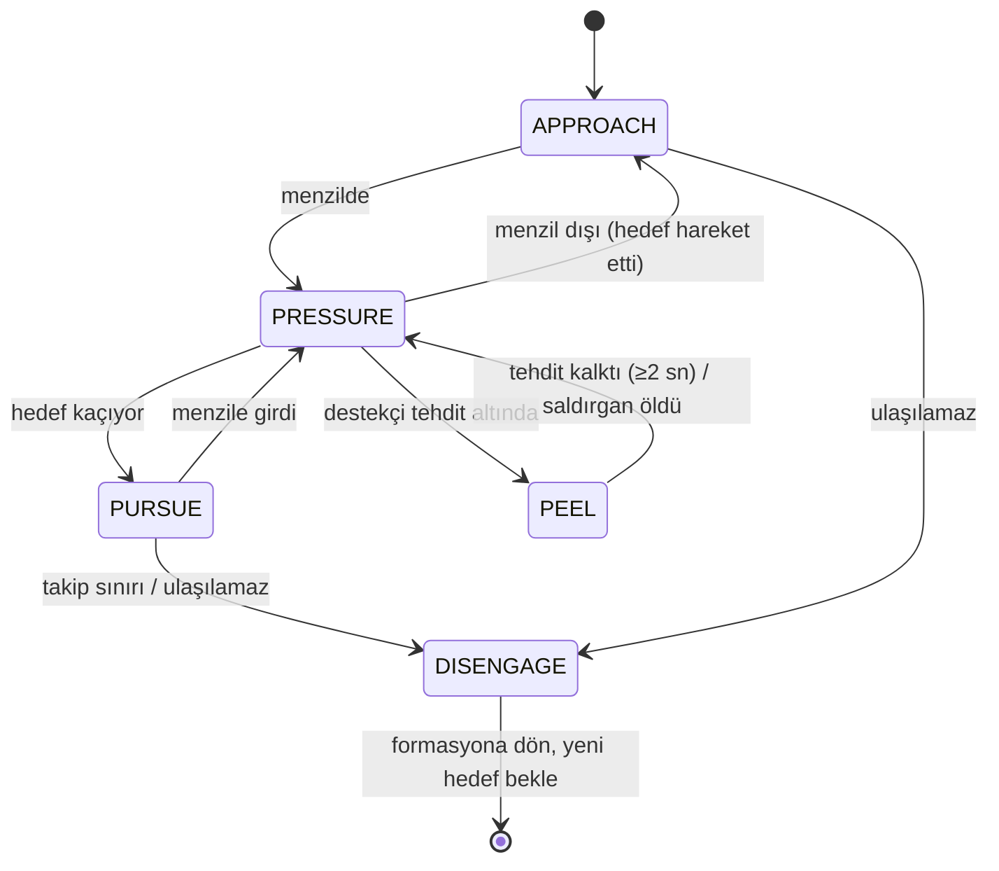

# 06 — Warrior Davranışı

> Durum: Taslak v1.0 · Araştırma tarihi: 2026-10-01 · Referans commit: `0f52027`
> Profiller: `warrior.pressure` (W-P) ve `warrior.guard` (W-G) — [04](04_CHARACTER_BUILDS_STATS_AND_EQUIPMENT.md) §5.1–5.2. Skill verisi: [05](05_SKILL_CATALOG_AND_COMBAT_RULES.md) §5. Mekanik: [03](03_VERSION_COMPATIBILITY_AND_VERIFIED_MECHANICS.md). Ortak durum makinesi ve bileşenler: [13](13_BOT_ARCHITECTURE_AND_DATA_MODEL.md). Hedef seçimi ve takım kuralları: [09](09_PARTY_COORDINATION_AND_TARGET_SELECTION.md). Geri çekilme ve pot: [11](11_RESOURCE_POTION_AND_SURVIVAL_MANAGEMENT.md).
> Bu dokümandaki tüm eşikler **ayarlanabilir tasarım parametresidir** `[Ö]`; doğrulanmış oyun değeri değildir.

---

## 1. Amaç ve kapsam

Warrior, takımın ana **yakın dövüş baskı** kaynağıdır. Davranışın amacı:

1. Atanan hedefe ulaşmak ve menzili korumak.
2. Sunucunun kabul ettiği en yüksek geçerli tempoda (saniyede bir Type1 + izinli R) hasar üretmek.
3. Kaçan veya kite eden hedefi yavaşlatmak/köklemek; takibi zamanında bırakmak.
4. Düşman healer'ının hedefi tutmasını kırmak (healer'a geçiş, [09](09_PARTY_COORDINATION_AND_TARGET_SELECTION.md)).
5. Kendi priest ve mage'lerini korumak (W-G ana görevi, W-P ikincil).
6. Tehlikeli konuma aşırı ilerlememek; düşük canda geri çekilip geri dönmek.

Kapsam dışı: kalkan/silah değiştirme taktikleri (ilk sürümde sabit ekipman), transform, rogue/archer etkileşimi.

## 2. Girdiler (gözlem sözleşmesine uygun, [03](03_VERSION_COMPATIBILITY_AND_VERIFIED_MECHANICS.md) §16)

| Girdi | Kaynak |
|---|---|
| Kendi HP/MP, buff/debuff'lar ve kalan süreleri, recast'ler, sunucu saniyesi, son R/Type1 zamanı | Kendi durumu |
| Hedef: konum, mesafe, sınıf, görünür ekipman, kesin HP (vurduktan sonra veya seçili hedef olarak), üzerindeki gözlenen debuff'lar (Malice/Torment/Parasite vb.), hareket yönü ve hızı (son 2 sn) | Bölge paketleri, `WIZ_TARGET_HP` |
| Takım: ortak hedef, çağıranın kimliği, debuff çağrısı, üyelerin HP/MP, konumları, priest/mage'e temas eden düşman melee'ler | `TeamBlackboard` ([09](09_PARTY_COORDINATION_AND_TARGET_SELECTION.md)) |
| Arazi: hedefe yürünebilir yol uzunluğu, kaçış yönü, takip mesafesi | `NavService` ([12](12_NAVIGATION_AND_POSITIONING.md)) |

## 3. Parametreler (bu doküman sahibidir)

| Kimlik | Varsayılan | Açıklama | Öğrenmeye açık |
|---|---|---|---|
| P-WAR-MELEE-RANGE | `min(skill menzili, 15 + silah.Range) − P-SK-RANGE-MARGIN` | Saldırı mesafesi hedefi | Hayır |
| P-WAR-MP-RESERVE | 700 MP | Scream (300) + leg cutting (84) + sprint + pay; bu rezervin altında yalnızca Carving ve R | Evet (400–1200) |
| P-WAR-BURST-MP | 1500 MP | Bu MP'nin üstünde Howling Sword tercih edilir | Evet |
| P-WAR-FINISH-HP | %25 | Hedef HP bu oranın altındaysa en yüksek hasarlı skill (Howling/sword dancing) | Evet (%15–40) |
| P-WAR-SLOW-TRIGGER | Hedef hızı ≥ kendi hızının %90'ı ve mesafe artıyor (2 sn) | leg cutting/Scream tetiği | Evet |
| P-WAR-CHASE-MAX-DIST | 35 m (ortak hedeften/takım merkezinden ayrılma) | Takip sınırı; karşı ulus tower halkası ayrıca kesin sınırdır ([12](12_NAVIGATION_AND_POSITIONING.md) §7) | Evet |
| P-WAR-CHASE-MAX-TIME | 8 sn erişememe | Takip sınırı | Evet |
| P-WAR-PEEL-RADIUS | 8 m | Kendi priest/mage'e bu mesafedeki düşman melee "temas" sayılır | Evet |
| P-WAR-PEEL-THRESHOLD | Destekçinin HP'si < %50 ve temas ≥ 1,5 sn | Peel tetiği | Evet |
| P-WAR-FRONTLINE-MAX | Takım merkezinden 20 m | Aşırı ilerleme sınırı (hedef takibi hariç) | Evet |

## 4. Karar öncelikleri

Her karar tick'inde (100 ms, [13](13_BOT_ARCHITECTURE_AND_DATA_MODEL.md)) en yüksek öncelikli geçerli kural kazanır. 1–4 **acil override**'dır, 5–9 utility skorlu seçeneklerdir.

1. **Ölüm önleme:** [11](11_RESOURCE_POTION_AND_SURVIVAL_MANAGEMENT.md) geri çekilme kararı `RETREAT` diyorsa geri çekil (pot ve sprint ile birlikte).
2. **Kritik pot:** HP eksiği ve tehdit [11]'deki kritik bandaysa HP potu (aksiyon kilidini engellemez; pot ayrı slot, MEC-POT-02).
3. **Takılma kurtarma:** `NavService` takılma bildiriyorsa [12]'deki kurtarma aşaması.
4. **Peel override (W-G'de her zaman, W-P'de yalnızca en yakın warrior ise):** Destekçi tehdit altında (P-WAR-PEEL-THRESHOLD) → saldırgana geç, gerekiyorsa `descent` (W-G) veya sprint ile yaklaş, Scream/leg cutting ile kilitle.
5. **Ortak hedefe baskı:** Takım hedefi geçerli ve ulaşılabilir → yaklaş + saldırı döngüsü (§6).
6. **Kaçışı engelleme:** Hedef kaçıyor (P-WAR-SLOW-TRIGGER) → leg cutting; leg cutting recast'teyse veya hedef hâlâ kaçıyorsa Scream; o da yoksa sprint ile takip (takip sınırına kadar).
7. **Healer baskısı:** [09](09_PARTY_COORDINATION_AND_TARGET_SELECTION.md) healer geçişi kararı verdiyse düşman priest'ine geç; Scream/Shock Stun ile cast kesintisi fırsatı.
8. **Buff bakımı:** Savaş dışında veya güvenli pencerede Gain, Outrage/Frenzy (W-P), Defense yalnızca priest AC buff'ı **yoksa** (§5 çakışma kuralı).
9. **Regroup:** Ortak hedef yok → takımın önüne, P-WAR-FRONTLINE-MAX içinde konumlan ([12](12_NAVIGATION_AND_POSITIONING.md) formasyon).

## 5. Çakışma ve bilgi kuralları (warrior'a özgü)

- `Defense` (106007, AC buff'ı) ile priest Insensibility buff'ları aynı BuffType'tır ([05](05_SKILL_CATALOG_AND_COMBAT_RULES.md) §4). Party'de P-HB varsa warrior Defense **kullanmaz**.
- `Gain` (STR) priest `Strength` ile çakışır. Party'de priest Strength planı varsa Gain kullanılmaz. Varsayılan: warrior Gain kullanır, priest Strength'i warrior'lara atmaz ([07](07_PRIEST_BEHAVIOR.md) buff matrisi).
- Outrage/Frenzy, düşman Slow debuff'ı ile silinir. Slow geldiğinde yeniden buff denenmez; debuff süresi dolana veya cure edilene kadar beklenir.
- Hedefin Mage Armor durumu (gözlenen buff olayıyla) varsa: MB-03 nedeniyle her vuruş tam hasar yansıtır. Hedef skoru bunu "yüksek maliyet" olarak alır ([09](09_PARTY_COORDINATION_AND_TARGET_SELECTION.md)). Warrior HP'si < %60 ise o hedefe vurmaz.

## 6. Saldırı döngüsü (baskı)

### 6.1 Zamanlama kuralları

| Kural | Değer | Dayanak |
|---|---|---|
| Type1 skill | Sunucu saniyesi başına en fazla 1; skill recast'i gerçek ms ile | MEC-MAG-02/03, CLI-04 |
| R | `max(silah gecikmesi / saldırı hızı çarpanı, 1,0 sn)` ve farklı sunucu saniyesi; skill gönderiminden sonra 0,3 sn R yok | CLI-01, CLI-02, MEC-R-07 |
| Ayakta skill (Howling Sword) | Önce durma hareketi (`speed=0`), ≥ 1 tick sonra skill | CLI-09 |
| Menzil | R: 15 + silah menzili; Type1: aynı + skill menzili | MEC-R-05 |

### 6.2 Skill seçimi (Type1 slotu)

Her sunucu saniyesinde bir Type1 hakkı vardır. Seçim:

| Koşul | Seçim |
|---|---|
| Hedef kaçıyor ve leg cutting hazır | leg cutting |
| Hedef kaçıyor, leg cutting recast'te, Scream hazır, MP ≥ 300 + rezerv | Scream |
| Hedef HP < P-WAR-FINISH-HP ve MP ≥ 400 + rezerv ve ayakta durulabilir (hedef ≤ menzil − 1 m) | Howling Sword |
| MP ≥ P-WAR-BURST-MP ve debuff penceresi açık (takım çağrısı < 10 sn önce) | Howling Sword (ayakta değilse sword dancing) |
| Hedefin kaçınması yüksek (son 10 denemede ıska oranı ≥ %30) | prick (sabit isabet) |
| Varsayılan | **Carving** (en iyi hasar/MP, [05](05_SKILL_CATALOG_AND_COMBAT_RULES.md) §5) |
| MP < rezerv | Carving yalnızca MP ≥ 90 + rezerv ise; aksi halde yalnızca R ve MP potu |

Bu tablo L0 baseline'dır. "Eşit geçerli seçenekler arasındaki sıra" ve eşikler L1 optimizasyonuna açıktır ([14](14_LEARNING_AND_ADAPTATION.md) §4.2).

### 6.3 Pseudocode

```
on_tick(bot):
  s = bot.perception.snapshot()                 # gözlem sözleşmesine uygun
  if survival.retreat_needed(s): return state.RETREAT
  if nav.stuck(bot): return nav.recover(bot)
  tgt = team.assigned_target(bot) or bot.self_target(s)
  if peel_needed(s): tgt = peel_target(s)       # W-G daima, W-P en yakın warrior ise
  if tgt is None: return formation.hold_front(bot)
  path = nav.path_to_melee(bot, tgt, P_WAR_MELEE_RANGE)
  if path.unreachable or chase_limit_exceeded(bot, tgt):
      team.report_unreachable(bot, tgt); return formation.hold_front(bot)
  if not in_melee(bot, tgt):
      if far(bot, tgt) and sprint_ready(): act.cast(SPRINT, self)
      return act.move_along(path)
  # menzil içinde: hareket yok, saldırı
  if fairness.r_ready(bot) and tgt.attackable: act.attack(tgt)
  if fairness.type1_ready(bot):
      sk = choose_type1(s, tgt)                 # §6.2 tablosu / utility
      if sk.use_standing: act.stop_then_cast(sk, tgt)
      else: act.cast(sk, tgt)
  potion.maybe_use(bot, s)                      # [11] kuralları, ayrı slot
```

`act.*` çağrıları [13](13_BOT_ARCHITECTURE_AND_DATA_MODEL.md)'teki `ActionExecutor` üzerinden gerçek paket olarak sunucuya gider. `fairness.*` kontrolleri `BotFairnessGuard`'dadır.

## 7. Durumlar ve geçişler

Ortak durumlar [13](13_BOT_ARCHITECTURE_AND_DATA_MODEL.md) §6'dadır. Warrior'a özgü `COMBAT` alt durumları:



| Geçiş | Koşul | Histerezis |
|---|---|---|
| PRESSURE → PURSUE | Mesafe 2 sn boyunca artıyor ve > menzil | 0,5 sn içinde menzile dönerse geçiş yok |
| PURSUE → DISENGAGE | Ortak hedeften/takımdan ayrılma > P-WAR-CHASE-MAX-DIST veya erişememe > P-WAR-CHASE-MAX-TIME, ya da hedef kendi guard tower halkasına girdi ([12](12_NAVIGATION_AND_POSITIONING.md)) | — |
| * → PEEL | P-WAR-PEEL-THRESHOLD | Peel'den çıkış için tehdit ≥ 2 sn yok |

## 8. Hata ve fallback davranışları

| Durum | Davranış |
|---|---|
| Skill sunucuda fail (`SRV_FAIL_*`) | Sebep koduna göre: menzil → yaklaş; recast → tablo/saat düzeltmesi ve telemetri; MP → MP potu veya Carving'e düş; hedef geçersiz → hedef bırak |
| Hedef öldü | Ortak hedefe veya [09] yeni hedef kuralına dön; bir sonraki karar ≤ 300 ms |
| Hedef görüş alanından çıktı | Son görülen konuma en fazla 3 sn yürü, sonra DISENGAGE |
| Slow/stun/kök altında | CLI-05: hareket hızı düşürülür, stun'da hareket yok; R/skill menzilde ise sürer; P-HD'ye cure isteği (`TeamBlackboard`) |
| Freeze altında hedef | Hedefli aksiyon yok (SK-07); başka hedef veya bekle |
| Stone of Warrior bitti | Scream/Exceed Break/Shock Stun devre dışı; telemetri uyarısı |

## 9. Solo ve party farkları

| Konu | Party | Solo ([10](10_SOLO_PK_BEHAVIOR.md)) |
|---|---|---|
| Hedef | Ortak hedef | Kendi seçimi, eşleşme skoru |
| Takip | Takımdan ayrılma sınırı | Kendi güvenlik sınırı ve kaçış yolu |
| HP yönetimi | Priest heal'i varsayılır, pot daha geç | Restoration/Regeneration ve pot daha erken |
| Buff | Priest buff'larıyla çakışma kuralları | Defense ve Gain serbest |

## 10. Test senaryoları ([15](15_TEST_ARENA_SCENARIOS_AND_ACCEPTANCE_CRITERIA.md))

| Test | Amaç |
|---|---|
| T-WAR-01 | Hareketsiz hedefe tempo: 60 sn boyunca Type1 ve R kabul oranları |
| T-WAR-02 | Kaçan hedef: leg cutting/Scream kullanımı ve takip bırakma sınırı |
| T-WAR-03 | Engelli arazide hedefe erişim (köprü/dar geçit) |
| T-WAR-04 | Peel: priest'e saldıran düşman warrior'a geçiş süresi |
| T-WAR-05 | MP rezervi: uzun savaşta Scream'in gerektiğinde hazır olması |
| T-WAR-06 | Mage Armor'lu hedefe vurma kararı |
| T-WAR-07 | Defense/AC buff çakışmasının önlenmesi |

## 11. Kabul kriterleri

| Kimlik | Kriter (S1 ekipman, sabit hedef senaryosu hariç tümü 20+ tekrar) |
|---|---|
| AC-WAR-01 | T-WAR-01'de MET-ACT-01 ≥ %85; sunucuya giden geçersiz aksiyon (MET-ACT-02) ≤ %2; fairness ihlali 0 |
| AC-WAR-02 | Ortak hedef ulaşılabilirken MET-TGT-02 (baskı sürekliliği) ≥ %70 |
| AC-WAR-03 | T-WAR-02'de kaçan hedefe yavaşlatma uygulama oranı ≥ %80 (hedef direnmediğinde); takip sınırı aşımı 0 |
| AC-WAR-04 | T-WAR-04'te peel tepki süresi p50 ≤ 1,5 sn |
| AC-WAR-05 | Scream gerektiğinde MP yetersizliği nedeniyle kullanılamama oranı ≤ %10 |
| AC-WAR-06 | Defense ile priest AC buff çakışması 0 (MET-BUFF-03 dahil) |

## 12. Bağımlılıklar ve açık sorular

- CLI-01/02 değerlerinin gerçek istemciyle ölçülmesi (T-MECH-CLIENT-01).
- Binding/provoke (Type7) sunucu etkisi belirsiz (MB-10); ilk sürümde kullanılmaz.
- Hasar modeli (05 §5) ölçümle doğrulanmalı (T-MECH-DMG-01/02).

## Değişiklik günlüğü

| Tarih | Sürüm | Değişiklik |
|---|---|---|
| 2026-10-01 | v1.0 | İlk sürüm |
