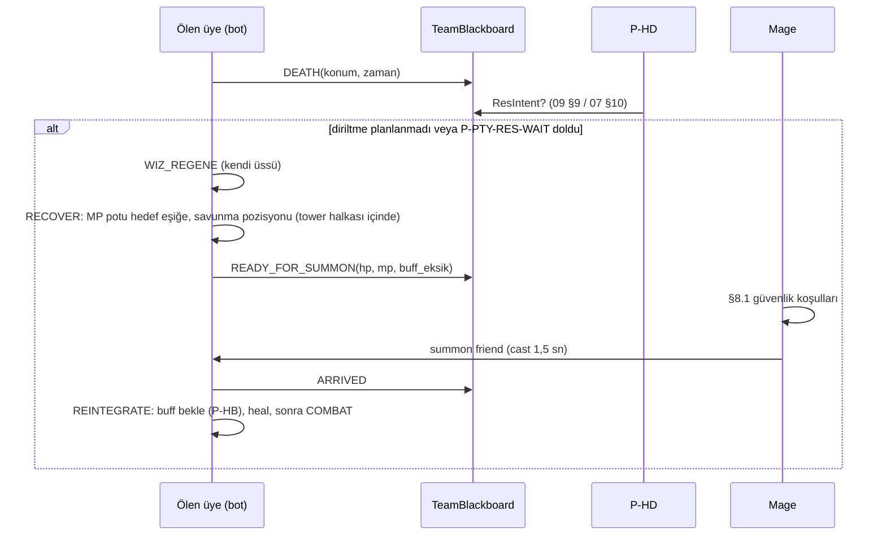

# 08 — Mage Davranışı

> Durum: Taslak v1.0 · Araştırma tarihi: 2026-10-01 · Referans commit: `0f52027`
> Profiller: `mage.fire_burst` (M-F) ve `mage.ice_control` (M-I) — [04](04_CHARACTER_BUILDS_STATS_AND_EQUIPMENT.md) §5.5–5.6. Skill verisi: [05](05_SKILL_CATALOG_AND_COMBAT_RULES.md) §7, `appendix/A3`. Summon mekaniği: [03](03_VERSION_COMPATIBILITY_AND_VERIFIED_MECHANICS.md) §5.5 (MEC-T8-01..03). Ölüm sonrası takım akışı: [09](09_PARTY_COORDINATION_AND_TARGET_SELECTION.md) §9.
> Eşikler ayarlanabilir tasarım parametresidir `[Ö]`.

---

## 1. Amaç ve kapsam

1. Ortak hedefe menzilden yüksek hasar (M-F) veya yavaşlatma ile kontrol (M-I).
2. Kümelenmiş düşmana alan hasarı ve alan yavaşlatması.
3. Yakın dövüş baskısından kaçınma: mesafe, kiting, Mana Shield, geri çekilme.
4. Party'ye destek: direnç buff'ı (takım planına göre), ölüp respawn olan üyeyi **summon friend** ile geri çekme.
5. Summon sonrası takımın yeniden organize olmasına katkı.

Mage'in taban HP'si çok düşüktür (M-F ~896, M-I ~1582; [04](04_CHARACTER_BUILDS_STATS_AND_EQUIPMENT.md) §4). Bu nedenle davranışın temel kısıtı **hayatta kalmaktır**.

## 2. Mekaniklerin ayrımı: diriltme, respawn, summon

| Kavram | Ne olur | Kim yapar | Konum | Sonra | Kaynak |
|---|---|---|---|---|---|
| **Diriltme** (Resurrection) | Ölü üye ceset konumunda dirilir; HP dolu, **MP 0**, buff'lar sıfırlanır, scroll buff'ları geri gelir; blink yok | Priest (P-HD), Type5 | Ceset konumu (savaş alanı) | Hemen savaşta, MP'siz | 03 §5.4, MEC-DTH |
| **Respawn** (yeniden doğma) | Ölü oyuncu `WIZ_REGENE` ile kendi ulus başlangıç noktasında doğar; HP dolu, MP dolmaz, buff yok; Ronark'ta blink yok | Oyuncu/bot kendisi | Karus (1380–1390, 1090–1100) / El Morad (630–640, 920–930) | Kendi guard tower halkasının içinde | MEC-DTH-05..08 |
| **Summon** (summon friend) | **Canlı** party üyesi çağıranın konumuna ışınlanır | Mage, Type8 warp 12 | Mage'in konumu | Mage'in yanında | MEC-T8-01..03 |

Kullanıcının tarif ettiği temel akış **respawn → summon**'dur: üye ölür, kendi üssünde respawn olur, toparlanır, mage onu yanına çeker, üye takıma tekrar katılır. **Ölü üye summon edilemez** (MEC-T8-03); summon yalnızca respawn veya diriltme sonrasında mümkündür.

## 3. Girdiler

| Girdi | Kaynak |
|---|---|
| Kendi HP/MP, recast'ler, Mana Shield/Absolute power durumu, sunucu saniyesi | Kendi durumu |
| Düşmanlar: konum, sınıf, hareket vektörü; kendine en yakın düşman melee mesafesi | Bölge paketleri |
| Hedef HP (vurduktan sonra kesin), verilen hasar örnekleri (element başına) | `WIZ_TARGET_HP` |
| Takım: ortak hedef, çağrılar, summon istekleri, üyelerin konumu/ölü durumu/respawn durumu | `TeamBlackboard` |
| Alan hasarı adayları: kümelenme (r=8, r=15) | Perception kümeleme |

## 4. Parametreler

| Kimlik | Varsayılan | Açıklama | Öğrenmeye açık |
|---|---|---|---|
| P-MAG-PREF-RANGE | 30–45 m | Tercih edilen mesafe bandı (çoğu ana skill 56 menzil; ayakta skill'ler 45) | Evet |
| P-MAG-MELEE-DANGER | 18 m | Düşman melee bu mesafedeyse kiting/kaçınma | Evet |
| P-MAG-AOE-MIN | 3 (r=15), 2 (r=8 burst) | Alan skill'i için minimum hedef sayısı | Evet |
| P-MAG-MP-RESERVE | 500 MP | Summon (5) + Mana Shield (150) + Blizzard (200) + pay | Evet |
| P-MAG-BURST-WINDOW | Takım debuff çağrısından sonraki 6 sn | Absolute power + incineration penceresi | Evet |
| P-MAG-SUMMON-SAFE-RADIUS | 25 m | Mage'in çevresinde bu yarıçapta düşman yoksa summon | Evet |
| P-MAG-SUMMON-MIN-HP | Mage HP oranı ≥ 0,6 | Summon için kendi durumu | Evet |
| P-MAG-SUMMON-DELAY | Üye `READY_FOR_SUMMON` dedikten sonra ≤ 2 sn | Tepki hedefi | Hayır |
| P-MAG-ELEM-SAMPLES | 3 | Element direnci tahmini için minimum örnek | Evet |

## 5. Karar öncelikleri

1. **Ölüm önleme** ([11](11_RESOURCE_POTION_AND_SURVIVAL_MANAGEMENT.md)): Mage için geri çekilme eşiği daha erkendir (rol düzeltmesi, [11] §4).
2. **Yakın tehdit:** Düşman melee ≤ P-MAG-MELEE-DANGER ve kendi W-G'miz peel etmiyor → (a) Mana Shield (yoksa), (b) yavaşlatma (M-I: Frost nova/Blizzard; M-F: Ice comet), (c) kiting hareketi (§7), (d) peel isteği.
3. **Summon görevi:** Bekleyen summon isteği ve §8 güvenlik koşulları sağlanıyor → summon friend.
4. **Ortak hedef patlaması:** Debuff çağrısı penceresinde (P-MAG-BURST-WINDOW) → Absolute power (hazırsa) → incineration (M-F) veya Prismatic (M-I) → Pillar of fire / Ice comet.
5. **Alan fırsatı:** r=15 içinde ≥ 3 düşman → meteor Fall / Supernova / Frost nova / ice storm; r=8 içinde ≥ 2 → Fire burst / Ice burst.
6. **Sürekli hasar:** Ortak hedefe en yüksek beklenen hasarlı hazır skill (§6).
7. **Destek:** Takım planındaki direnç buff'ı (yalnızca savaş dışı veya güvenli pencerede).
8. **Pozisyon:** Tercih edilen mesafe bandında, takımın arkasında, kaçış yolu açık.

## 6. Hasar seçimi

### 6.1 Element tahmini (oturum içi, L0.5)

Hedefin direnci gözlenemez. Ancak mage her vuruşta hedefin kesin HP'sini alır ([03](03_VERSION_COMPATIBILITY_AND_VERIFIED_MECHANICS.md) §16). Bot, element başına "gözlenen hasar / model hasarı" oranını hedef bazında tutar. P-MAG-ELEM-SAMPLES örnekten sonra oranı düşük olan element (direnç takılı) daha düşük puan alır. Bu, oyuncunun da yapabileceği bir çıkarımdır; gözlem sözleşmesini ihlal etmez.

### 6.2 Seçim tablosu (tek hedef)

| Koşul | M-F | M-I |
|---|---|---|
| Patlama penceresi, mesafe ≤ 44 m, durulabilir | incineration (−2500) | Prismatic (−1750 + yavaşlatma) |
| Hedef kaçıyor | Ice comet (yavaşlatma) | Ice comet / Blizzard |
| Standart | Pillar of fire (−1260, 5,3 sn) → Fire Impact (scroll) → Fire spear/Fire ball | Ice comet → Ice Impact → Ice orb |
| Hedef element direnci yüksek (6.1) | Buz ağacı yedekleri | Ateş ağacı yedekleri (Pillar of fire) |
| MP < rezerv | Yalnızca MP potu ve pozisyon; acil durumda Fire burst değil | Aynı |

Tempo sınırları: elementli Type3 için sunucu saniyesinde bir cast (MEC-MAG-03) ve istemci cast süresi (1,1–1,5 sn, CLI-03). Bot bir cast'in EFFECTING'i ile sonraki CASTING arasında ≥ 1 farklı sunucu saniyesi bırakır.

### 6.3 Alan hasarı kuralları

- Hedef noktası, kümenin ağırlık merkezi; çağıranın menzili içinde olmalı (CLI-07).
- Alan skill'leri yalnızca düşmanlara isabet eder (AREA_ENEMY). Dost ateşi yoktur `[D]`.
- Tip 4 alan skill'leri (ör. Light Shock; ilk kapsamda yok) bölgedeki düşman stealth'ini açar (MEC-BUF-09).
- Kümelenme sayımı yalnızca görünür düşmanlarla yapılır.

## 7. Mesafe ve kiting

```
kite_step(m):
  threat = nearest_enemy_melee(m)
  if threat.dist > P_MAG_MELEE_DANGER: return None
  dir = nav.safe_retreat_direction(m, away_from=threat, toward=team_center)   # [12]
  if dir is None: return None                                                  # sıkışma → [11] fallback
  # cast süresi boyunca durmak gerekir: düşman bu sürede ne kadar yaklaşır?
  t_cast = 1.5
  if threat.dist - threat.speed_est * t_cast > threat.attack_range + 2:
      return CAST_THEN_MOVE         # önce cast, sonra adım
  return MOVE_THEN_CAST             # önce mesafe aç
```

- Bot kendi üzerindeki yavaşlatmayı hareketine uygular (CLI-05).
- Kiting, takım merkezinden P-PTY-SPREAD-MAX'ten fazla uzaklaşmaz ([09](09_PARTY_COORDINATION_AND_TARGET_SELECTION.md)). Mage takımdan koparsa ölüm riski artar; kiting yönü takım merkezine doğru eğilimlidir.
- Blink (110774, Etc 517) standart profilde yoktur (CHR-08).

## 8. Summon akışı (respawn → summon → yeniden katılım)



### 8.1 Güvenlik koşulları (summon ancak hepsi sağlanırsa)

| Kimlik | Koşul | Gerekçe |
|---|---|---|
| SUM-01 | Hedef üye **canlı**, aynı zone'da, party'de, No-Recall debuff'ı yok, ışınlanmıyor | MEC-T8-01/03 |
| SUM-02 | Mage'in çevresinde P-MAG-SUMMON-SAFE-RADIUS içinde düşman yok ve son 3 sn'de mage'e yönelik düşman alan skill'i olayı yok | Gelen üyenin doğrudan ölüme ışınlanmasını önleme |
| SUM-03 | Mage HP oranı ≥ P-MAG-SUMMON-MIN-HP ve mage geri çekilme durumunda değil | Mage ölürse gelen üye yalnız kalır |
| SUM-04 | Takımın en az bir priest'i ve bir başka canlı üyesi mage'den ≤ 40 m | Gelen üyeye buff/heal desteği |
| SUM-05 | Hedef üye `READY_FOR_SUMMON` bildirdi: HP ≥ %90, MP ≥ rol eşiği ([11]) | Toparlanmamış üyeyi çekmeme |
| SUM-06 | Takım "ezici yenilgi" durumunda değil (canlı sayımız ≥ görünür düşmanın %40'ı) | Kaybedilen savaşa takviye atmama; bunun yerine geri çekilme/regroup ([09]) |
| SUM-07 | Mage aynı anda acil durum aksiyonunda (kiting, kendi pot'u) değil | Öncelik çatışması |

Koşullar sağlanmıyorsa: üye **yürüyerek** regroup noktasına gelir ([09](09_PARTY_COORDINATION_AND_TARGET_SELECTION.md) §9) veya kendi üssünde bekler. Summon, savaşın gidişatına göre ertelenebilir. Bekleme ≥ 30 sn olursa lider "yürüyerek katıl" kararı verir.

### 8.2 Kimin önce summon edileceği

Birden fazla bekleyen üye varsa sıra: priest > ana hasar (W-P/M-F) > diğerleri. İki üye arasında mage, recast 0,1 sn olmasına rağmen istemci cast süresi (1,5 sn) nedeniyle sıralı çalışır.

### 8.3 Summon sonrası

- Gelen üye `REINTEGRATE` durumuna girer: P-HB buff matrisi önceliği ona verilir, P-HD/P-HB heal kontrolü yapılır, gerekirse MP potu içilir.
- Üye en fazla `P-PTY-REINTEGRATE-MAX` (varsayılan 6 sn) sonra, buff eksik olsa bile, ortak hedefe katılır.

## 9. Kendini koruma

| Durum | Aksiyon |
|---|---|
| Melee teması (≤ 5 m), HP > %50 | Mana Shield (yoksa) + yavaşlatma + adım |
| Melee teması, HP ≤ %50 | Geri çekilme ([11]); W-G peel isteği; pot |
| Kök/yavaşlatma altında | Priest cure isteği (`TeamBlackboard`); menzildeki hedefe cast sürdür |
| Silence altında | Geri çekil; cure iste |
| Kendi direnç buff'ı | Takım planındaki direnç tipine uyarak, savaş dışında |

## 10. Durumlar

`COMBAT` alt durumları: `BURST`, `SUSTAIN`, `KITE`, `SUMMON`, `REPOSITION`. `KITE` ve `SUMMON` birbirini dışlar (SUM-07).

## 11. Hata ve fallback

| Durum | Davranış |
|---|---|
| Summon fail (hedef ışınlanıyor/No-Recall/öldü) | 3 sn sonra koşullar yeniden değerlendirilir; 3 fail sonrası "yürüyerek katıl" |
| Cast sırasında hedef menzilden çıktı | EFFECTING gönderilmez (SK-02); yeni hedef/yer |
| Scroll/taş eksik (Absolute power, Fire Impact) | İlgili skill devre dışı, telemetri uyarısı |
| Gate (110015) Ronark'ta çalışmıyorsa | Kullanılmaz (T-MECH-T8-02) |
| MP bitti, pot cooldown'da | Geri çekil, sit-down **yok** (savaşta) |

## 12. Test senaryoları ve kabul kriterleri

| Test | Amaç |
|---|---|
| T-MAG-01 | Sabit hedefe hasar temposu ve cast/EFFECTING zamanlaması |
| T-MAG-02 | Warrior baskısı altında kiting ve hayatta kalma süresi |
| T-MAG-03 | Kümelenmiş 4 hedefe alan hasarı kararı (P-MAG-AOE-MIN) |
| T-MAG-04 | Element direnci giyen hedefe karşı element değiştirme |
| T-MAG-05 | Respawn → summon → yeniden katılım; güvenlik koşulu ihlali senaryoları (mage savaşta, düşman yakında, mage düşük HP) |
| T-MAG-06 | İki üyenin aynı anda summon beklemesi |

| Kimlik | Kriter |
|---|---|
| AC-MAG-01 | T-MAG-01: sunucuya giden geçersiz cast ≤ %2; cast süresi ihlali (CLI-03) = 0 |
| AC-MAG-02 | T-MAG-02: W-P'ye karşı tek başına hayatta kalma süresi baseline'dan kötü değil; W-G desteğiyle ölüm oranı ≤ %20 (20 tekrar) |
| AC-MAG-03 | MET-AOE-01 ≥ P-MAG-AOE-MIN − 0,5 (alan skill'i başına ortalama isabet) |
| AC-MAG-04 | T-MAG-05: güvensiz summon (MET-SUM-02) ≤ %10; READY → summon gecikmesi p50 ≤ 2 sn (koşullar sağlandığında) |
| AC-MAG-05 | Ölü üyeye summon denemesi = 0 |

## 13. Bağımlılıklar ve açık sorular

- Koşu hızı ve yürüyüş süresi (respawn → arena) ölçülmeli; summon'un değeri buna bağlı (T-NAV-05).
- Mage'in cast sırasında hareketinin istemcide cast'i iptal ettiği varsayımı (T-MECH-CLIENT-03).

## Değişiklik günlüğü

| Tarih | Sürüm | Değişiklik |
|---|---|---|
| 2026-10-01 | v1.0 | İlk sürüm |
