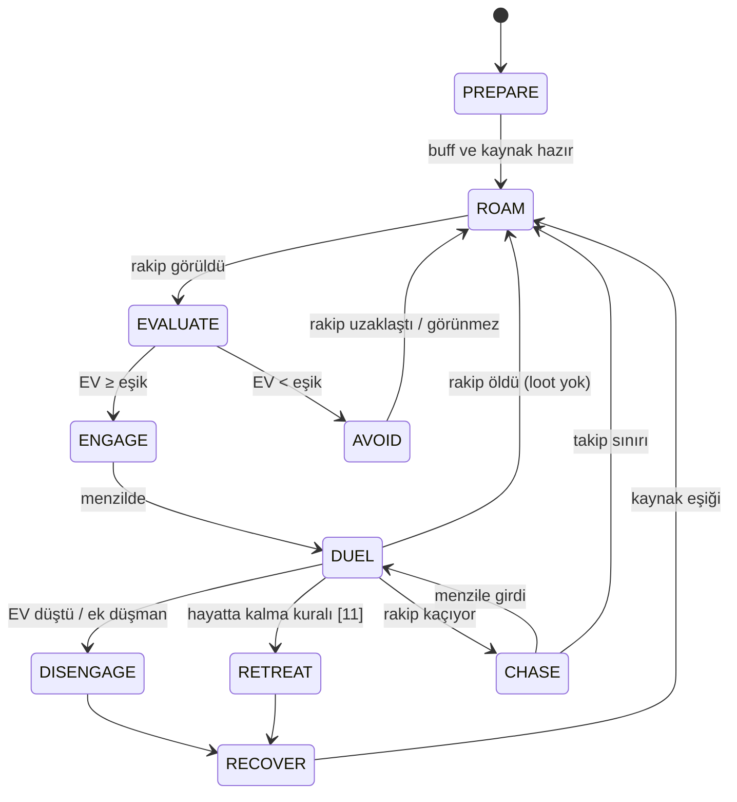

# 10 — Solo PK Davranışı

> Durum: Taslak v1.0 · Araştırma tarihi: 2026-10-01 · Referans commit: `0f52027`
> Solo mantık party mantığından **ayrı** bir karar katmanıdır. Sınıfların skill kullanım kuralları 06–08'den, hayatta kalma ve pot [11](11_RESOURCE_POTION_AND_SURVIVAL_MANAGEMENT.md)'den, navigasyon [12](12_NAVIGATION_AND_POSITIONING.md)'den gelir. Solo bot `TeamBlackboard` kullanmaz.
> Eşikler ayarlanabilir tasarım parametresidir `[Ö]`.

---

## 1. Amaç ve ilke

Solo bot, Ronark Land'de tek başına dolaşan, rakip bulan ve **kazanma olasılığı ile riski** değerlendirerek savaşa giren ya da kaçınan bir oyuncu gibi davranır.

İlke: her build her eşleşmeyi kazanmaya çalışmaz. Başarı, eşleşmeye göre doğru kararı vermektir: avantajlıyken girmek ve bitirmek, dezavantajlıyken kaçınmak veya zamanında çekilmek.

## 2. Durumlar



`RECOVER`: güvenli noktada (kendi tower halkası veya rakipsiz alan) pot ve heal. Oturmak (sitting, 6 sn'de bir +296 HP, MEC-DTH) yalnızca 60 m içinde düşman yokken yapılır.

## 3. Eşleşme değerlendirmesi

### 3.1 Girdiler (gözlemlenebilir)

| Girdi | Kaynak |
|---|---|
| Rakip sınıfı, görünür ekipman kademesi (zırh ID'lerinden S0/S1/S2 benzeri tahmin) | `GetUserInfo` |
| Rakip HP oranı | Bot rakibi seçili hedef yapıp HP isteyebilir ([03](03_VERSION_COMPATIBILITY_AND_VERIFIED_MECHANICS.md) §16, `P-OBS-TARGETHP-RATE`) |
| Rakibin yakınındaki düşman sayısı ve sınıfları (40 m) | Bölge paketleri |
| Rakibin son 10 sn'deki davranışı (kim ile savaştı, pot/heal olayları) | Gözlenen olaylar |
| Kendi HP/MP, pot stoku, cooldown'lar | Kendi durumu |
| Arazi: kaçış yolu, kendi tower halkasına mesafe, rakibin tower halkasına mesafe | [12](12_NAVIGATION_AND_POSITIONING.md) |

### 3.2 Eşleşme önsel tablosu `[Ö]`

Değerler başlangıç hipotezidir (1 = eşit). 1v1 testlerinde (EVAL-1v1-*) ölçülüp güncellenir. L2 aşamasında bandit bağlamı olur ([14](14_LEARNING_AND_ADAPTATION.md) §12).

| Bot \ Rakip | W-P | W-G | P-HD/P-HB | M-F | M-I |
|---|---|---|---|---|---|
| W-P | 1,0 | 1,1 | 1,3 | 1,2 (yaklaşabilirse) | 0,9 |
| W-G | 0,9 | 1,0 | 1,1 | 1,0 | 0,9 |
| Priest | 0,6 | 0,7 | 1,0 | 0,8 | 0,8 |
| M-F | 0,9 (mesafe varsa) | 1,0 | 1,2 | 1,0 | 0,9 |
| M-I | 1,0 | 1,1 | 1,1 | 1,0 | 1,0 |

### 3.3 Beklenen değer (EV)

```
p_win  = sigmoid( a0 + a1·log(önsel) + a2·(kendi_HP% − rakip_HP%) + a3·(kendi_kaynak_skoru)
                  − a4·ek_düşman_sayısı + a5·arazi_avantajı + a6·ekipman_farkı )
EV     = p_win·V_kill − (1 − p_win)·p_death_if_lose·C_death − C_time
ENGAGE ⇔ EV ≥ P-SOLO-ENGAGE-EV  (ve hysteresis: AVOID'den ENGAGE'e ancak EV ≥ eşik + 0,1)
```

Başlangıç katsayıları: `a0=0, a1=2,0, a2=1,5, a3=0,8, a4=1,2, a5=0,5, a6=0,6`; `V_kill=1`, `C_death=1,2`, `C_time=0,05`. Kaybeden taraf için ölüm olasılığı `p_death_if_lose` = 0,6 (zamanında kaçış varsayımıyla). Bu katsayılar L1 optimizasyonuna açıktır.

| Kimlik | Parametre | Varsayılan |
|---|---|---|
| P-SOLO-ENGAGE-EV | Savaşa giriş eşiği | 0,1 |
| P-SOLO-DISENGAGE-EV | Savaştan çıkış eşiği | −0,15 |
| P-SOLO-CHASE-MAX | Takip sınırı | 60 m veya 10 sn erişememe |
| P-SOLO-OUTNUMBER | Bu sayıda ek düşman görünürse çıkış | 1 (rakip dışında) |
| P-SOLO-RECOVER-HP / MP | ROAM'a dönüş eşikleri | %85 / %70 |
| P-SOLO-ROAM-ROUTE | Dolaşma rotası | Arena çevresi yol noktaları ([12](12_NAVIGATION_AND_POSITIONING.md)) |

## 4. Sınıf bazlı solo taktikleri

### 4.1 Warrior (W-P/W-G)

- Hazırlık: Gain, Outrage/Frenzy (W-P), Defense (solo'da priest yok, serbest), restoration HoT önceden.
- Yaklaşma: sprint; rakip kaçarsa leg cutting, ardından Scream.
- Düello: 06 §6 döngüsü; MP rezervini Scream için koru.
- Mage'e karşı: düz çizgide değil, kısa yönlü yaklaşma (görüş hattı testi olan noktalardan). Mage yavaşlatırsa (gözlenen) ve mesafe > 30 m ise takip yerine AVOID/geri çekilme değerlendirilir (takip sınırı).
- Priest'e karşı: Malice/Parasite yok; ancak priest'in heal'i cast süreli. Scream/Shock Stun ile heal cast'ini kesme fırsatı (istemci kesmesi `[A]`).

### 4.2 Mage (M-F/M-I)

- Hazırlık: Mana Shield (savaş başında), direnç buff'ı (rakip elementi biliniyorsa), Frozen armor/shell (solo'da priest yok, serbest).
- Açılış: azami menzilden yavaşlatma (Ice comet) → patlama (incineration/Prismatic) → Pillar of fire/Ice Impact.
- Melee'ye karşı: 08 §7 kiting; mesafe kapanırsa ve HP < %60 ise DISENGAGE.
- Düşük HP (M-F ~896 + item): tek bir W-P skill dizisi ölümcül olabilir. Bu yüzden solo M-F'nin ENGAGE eşiği daha yüksektir (`P-SOLO-ENGAGE-EV` + 0,15, rol düzeltmesi).

### 4.3 Priest (P-HD/P-HB) — destek build'lerinin solo sınırları

- Öldürme gücü düşüktür (saldırı ~361 AP, [04](04_CHARACTER_BUILDS_STATS_AND_EQUIPMENT.md) §4). Kendi heal'leri uzun dayanıklılık sağlar.
- P-HD: Malice + Parasite + Judgment/Helis ile yalnızca **zayıflamış** veya heal'siz rakiplere (rakip HP oranı < %50 ve destekçi görünmüyor) girer.
- P-HB: Kendine AC/HP buff'ı (Insensibility peel, massiveness) ile daha dayanıklıdır, ama debuff'ı yoktur. Solo'da ENGAGE yalnızca savunma (saldırıya uğradığında) veya rakip HP < %35 ise.
- Warrior'a karşı: kaçış ve tower halkasına çekilme; kendine heal ile zaman kazanma.
- Beklenen sonuç: priest solo'da az kill, yüksek hayatta kalma. Başarı ölçütü "kaçınılması gereken savaşa girmeme" ve "saldırıya uğrayınca hayatta kalma"dır.

## 5. Sayısal dezavantaj ve geri çekilme

- Rakip dışında ≥ P-SOLO-OUTNUMBER düşman 40 m içine girerse DISENGAGE.
- Geri çekilme yönü: kendi tower halkasına doğru, düşman kümesinden uzak ([12](12_NAVIGATION_AND_POSITIONING.md) §8).
- Kaçarken yavaşlatma (warrior leg cutting/mage Ice comet) yalnızca **takipçiye** atılır; kaçış hareketini bozmaz.
- Sıkışma (kaçış yolu yok, [11] §6): savaşmaya devam et ve en düşük HP'li düşmana odaklan ("son direniş").

## 6. Rakibe uyum (oturum içi)

Oturum içi istatistikler (L0.5, öğrenme değil durum kestirimi):

| Gözlem | Uyum |
|---|---|
| Rakip mage sürekli mesafe açıyor (kiting) | Warrior: leg cutting/Scream'i yaklaşma için sakla, sprint'i mesafe ≤ 25 m'de kullan |
| Rakip sık HP potu içiyor (gözlenen pot olayları ≥ 1/3 sn) | Patlamayı pot cooldown'u ile senkronla (pot olayından hemen sonra 2 sn pencere) |
| Rakip warrior kaçıyor ve geri dönüyor | Takip sınırını kısalt, rakibin tower halkasına yaklaşma |
| Rakip heal'i cast ediyor (gözlenen CASTING) | Cast kesme girişimi (Scream/Shock Stun) |

Bu istatistikler karakter kimliğiyle **kalıcı tutulmaz** (14 §6).

## 7. Pseudocode

```
solo_tick(b):
  s = b.perception.snapshot()
  if survival.retreat_needed(s): return RETREAT
  match b.state:
    PREPARE: ensure_buffs_and_resources(b) -> ROAM
    ROAM:    r = pick_opponent(s); if r: -> EVALUATE(r) else follow_route()
    EVALUATE(r):
      ev = estimate_ev(b, r, s)
      if ev >= P_SOLO_ENGAGE_EV + role_adj(b): -> ENGAGE(r) else -> AVOID(r)
    DUEL(r):
      if extra_enemies(s) >= P_SOLO_OUTNUMBER or estimate_ev(b,r,s) < P_SOLO_DISENGAGE_EV: -> DISENGAGE
      class_duel_step(b, r, s)                       # 06/07/08 kuralları
    CHASE(r):
      if chase_exceeded(b, r) or r.near_enemy_towers: -> ROAM
```

## 8. Test senaryoları ve kabul kriterleri

| Test | Amaç |
|---|---|
| T-SOLO-01 | Sınıf/rol bazlı 1v1 matrisi (6×6 profil, taraf değişimli, S1) |
| T-SOLO-02 | Avantajsız eşleşmeden kaçınma (ör. M-F vs W-P yakın mesafede başlama) |
| T-SOLO-03 | 1v2 karşılaşmasında geri çekilme |
| T-SOLO-04 | Kaçan rakibi takip sınırı |
| T-SOLO-05 | Priest solo: saldırıya uğrayınca hayatta kalma |
| T-SOLO-06 | Rakip davranışına uyum (kiter mage, pot spam'cı) |

| Kimlik | Kriter |
|---|---|
| AC-SOLO-01 | T-SOLO-01: her eşleşme için kazanma oranı ve %95 güven aralığı raporlanır; aynı profil eşleşmelerinde (ayna) taraf etkisi düzeltildikten sonra kazanma oranı %50 ± 10 |
| AC-SOLO-02 | T-SOLO-02: ENGAGE kararı verilen dezavantajlı başlangıçların oranı ≤ %20 |
| AC-SOLO-03 | T-SOLO-03: 1v2'de ölmeden kopma oranı ≥ baseline; ölüm oranı ≤ %60 |
| AC-SOLO-04 | Takip sınırı ihlali 0; rakip tower halkasına giriş 0 |
| AC-SOLO-05 | T-SOLO-05: priest'in 30 sn hayatta kalma oranı ≥ %70 (W-P'ye karşı, kaçış yolu varken) |

## Değişiklik günlüğü

| Tarih | Sürüm | Değişiklik |
|---|---|---|
| 2026-10-01 | v1.0 | İlk sürüm |
