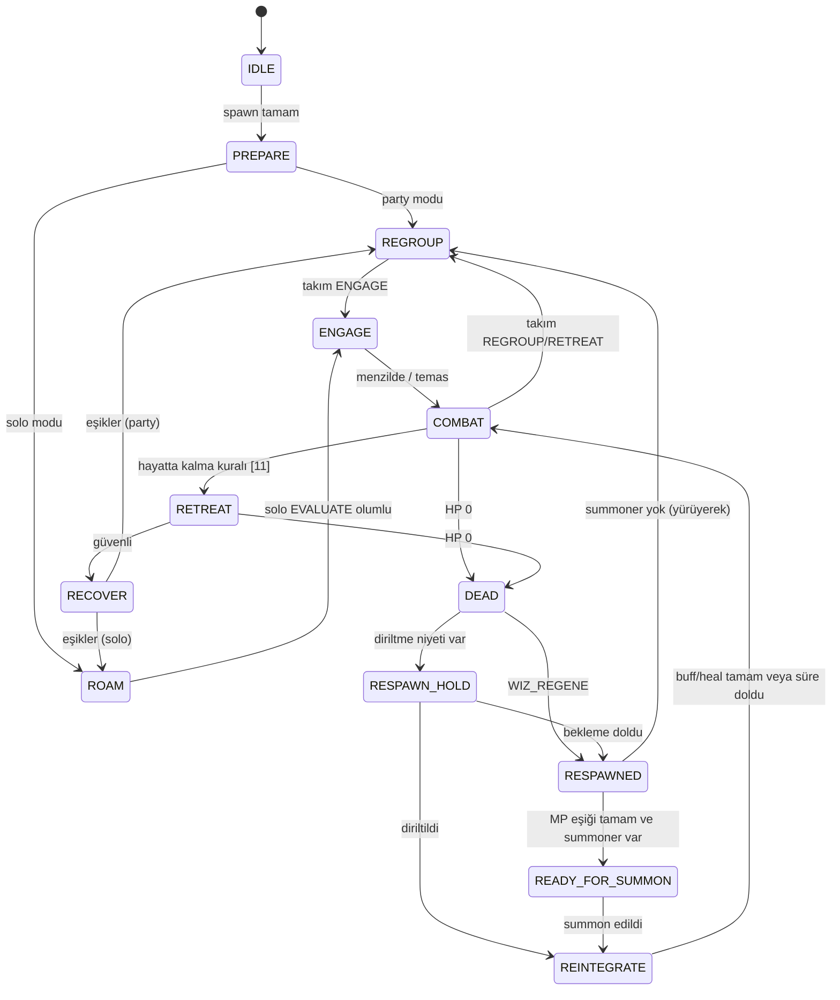

# 13 — Bot Mimarisi ve Veri Modeli

> Durum: Taslak v1.0 · Araştırma tarihi: 2026-10-01 · Referans commit: `0f52027`
> Bu doküman bileşenlerin, thread modelinin, bot yaşam döngüsünün, veri modelinin ve parametre kayıt defteri biçiminin tek kaynağıdır. Dayandığı depo gerçekleri [02](02_REPOSITORY_ANALYSIS_AND_INTEGRATION_MAP.md)'dedir (S1–S12 entegrasyon noktaları).
> Tüm tasarım `[Ö]`; dayandığı her mevcut kod noktası `[D]` olarak işaretlidir.

---

## 1. Mimari kararların özeti

| ADR | Karar | Gerekçe |
|---|---|---|
| ADR-0001 | Botlar GameServer içinde **oyuncu varlığı** (`CUser`) olarak, ayrılmış oturum slotlarında, soketsiz çalışır | Gerçek oyuncu kuralları, görünüm, party/chat ([02](02_REPOSITORY_ANALYSIS_AND_INTEGRATION_MAP.md) §10) |
| ADR-0005 (KABUL, [adr](adr/ADR-0005-bot-tick-thread-modeli.md); F2-02'de uygulanır) | v1'de bot tick'i ve aksiyonları **IOCP worker thread'inde** çalışır; periyodik tetik bir zamanlayıcıdan özel IOCP olayıyla gelir | Paket handler'larıyla seri yürütme; yarış koşullarından kaçınma |
| — | Bot aksiyonları gerçek paket olarak `CUser::HandlePacket`'e verilir | Ortak mekaniği yeniden uygulamama (02 §11.1) |
| — | Bot sistemi varsayılan **kapalı**, test modu ayrı bayrak | Canlı sunucuda kazara etkinleşmeyi önleme |

## 2. Bileşenler

```mermaid
flowchart TB
  subgraph GameServer process
    IOCP[IOCP worker thread]
    Timer[BotTickTimer thread] -- PostQueuedCompletionStatus(BOT_TICK) --> IOCP
    subgraph Bot subsystem
      BM[BotManager]
      BA[BotAgent x N]
      PER[Perception]
      BR[Brain: FSM + priority overrides + utility]
      TB[TeamBlackboard]
      AE[ActionExecutor]
      FG[BotFairnessGuard]
      NAV[NavService]
      PS[PolicyStore + ParamRegistry]
      TEL[Telemetry queue]
      SR[ScenarioRunner + bot commands]
    end
    CU[CUser bot sessions (reserved IDs)]
    H[Existing handlers: Attack, MagicProcess, ItemMove, Party, Chat, Move, Regene]
  end
  Writer[Telemetry writer thread] --> Files[(Logs/bots/*.jsonl)]
  IOCP --> BM --> BA
  BA --> PER --> BR --> AE --> FG --> H
  H -- Send() --> CU -- bot sink --> PER
  BR <--> TB
  BR --> NAV
  BR --> PS
  BA --> TEL --> Writer
  SR --> BM
```

| Bileşen | Sorumluluk | Not |
|---|---|---|
| `BotManager` | Bot listesi, spawn/despawn, tick zamanlaması, ayrılmış slot havuzu | Tekil |
| `BotAgent` | Bir botun durumu: profil, FSM, hafıza (EnemyIntel kopyası), zamanlayıcılar | Bot başına |
| `Perception` | Gözlem sözleşmesine uygun anlık görüntü (`PerceptionSnapshot`). Kaynaklar: botun kendi `CUser` durumu ve bot alıcısına gelen paketler. Düşman durumu yalnızca paketlerden. | [14](14_LEARNING_AND_ADAPTATION.md) §5.2; AC-LRN-03 |
| `Brain` | Ortak FSM (§6), öncelik override'ları, rol modülleri (06–08), solo modülü (10), utility skorlama (§7) | Deterministik + seed'li RNG |
| `TeamBlackboard` | Takım planı, çağrılar, rezervasyonlar, üye durumu | [09](09_PARTY_COORDINATION_AND_TARGET_SELECTION.md) §4 |
| `ActionExecutor` | Aksiyon → paket; CASTING/EFFECTING zamanlaması; sonuç eşleme (`ACTION_RESULT`) | [03](03_VERSION_COMPATIBILITY_AND_VERIFIED_MECHANICS.md) §14 |
| `BotFairnessGuard` | CLI-01..12 sınırlarını uygular; ihlal eden aksiyonu sunucuya göndermez, `FAIRNESS_REJECT` loglar | MET-FAIR-01 |
| `NavService` | [12](12_NAVIGATION_AND_POSITIONING.md) katmanları, A*, LoS, güvenli nokta, takılma kurtarma | Zone başına önhesap |
| `PolicyStore` / `ParamRegistry` | Parametre tanımları, aralıklar, rol profili başına politika sürümü, geri alma | §9 |
| `Telemetry` | Olay kuyruğu → yazıcı thread | [16](16_TELEMETRY_DEBUGGING_AND_PERFORMANCE.md) |
| `ScenarioRunner` | Senaryo yükleme, envanter doldurma, maç başlat/bitir, sonuç | [15](15_TEST_ARENA_SCENARIOS_AND_ACCEPTANCE_CRITERIA.md) |

## 3. Thread modeli (ADR-0005)

### 3.1 v1: tamamen IOCP thread'inde

1. `BotTickTimer` thread'i her `P-BOT-TICK-MS` (100 ms) bir `BOT_TICK` IOCP olayı gönderir. Yeni bir `SocketIOEvent` değeri eklenir ([`shared/SocketDefines.h:3-9`](https://github.com/ko4life-net/Fire-Drake-Project-v1453/blob/0f520272ae1f11472623d62bff76fff98562e7b3/shared/SocketDefines.h#L3-L9)). Olay, `PostQueuedCompletionStatus` ile kuyruğa bırakılır; kod tabanı bu yolu kapanışta zaten kullanıyor ([`shared/SocketMgr.cpp:151-154`](https://github.com/ko4life-net/Fire-Drake-Project-v1453/blob/0f520272ae1f11472623d62bff76fff98562e7b3/shared/SocketMgr.cpp#L151-L154)) `[D]`.
2. IOCP worker olayı alınca ([`shared/SocketMgr.cpp:58-89`](https://github.com/ko4life-net/Fire-Drake-Project-v1453/blob/0f520272ae1f11472623d62bff76fff98562e7b3/shared/SocketMgr.cpp#L58-L89) dağıtımı) `BotManager::Tick()` çağrılır. Tick, tüm botlar için algı → karar → aksiyon döngüsünü çalıştırır. Aksiyonlar doğrudan `CUser::HandlePacket()` ile işlenir. Gerçek oyuncu paketleri de aynı thread'de işlendiği için bot aksiyonları onlarla **seri** yürür.
3. Her bot için tick başına en fazla bir karar; aksiyonlar CLI tavanı içinde.
4. Bütçe: tick süresi MET-PERF-02 ile izlenir (16 bot için p95 ≤ 5 ms). Aşılırsa bot tick'leri gruplara bölünür (her tick'te botların bir kısmı).

### 3.2 v2 (gerekirse)

Algı ve karar ayrı bir worker'da, IOCP'de alınan **değişmez anlık görüntüler** üzerinde çalışır. Yalnızca aksiyon yürütme IOCP'ye döner. v1 bütçesi aşılmadıkça uygulanmaz.

### 3.3 Mevcut yarışlarla ilişki

30 sn zamanlayıcı ve DB thread'i `CUser` durumuna IOCP dışından dokunur ([02](02_REPOSITORY_ANALYSIS_AND_INTEGRATION_MAP.md) §4.4, R-CODE-03). Bot sistemi bu yarışları artırmaz. Bot `Update()` çağrıları IOCP'de yapılır (S8). Bot spawn/despawn sırasında oturum haritası değişiklikleri `KOSocketMgr::GetLock()` altında yapılır.

## 4. Bot oturumu (`CUser` + bot alıcısı)

### 4.1 Ayrılmış slotlar (S1)

- `KOSocketMgr::InitSessions` tüm `CUser` nesnelerini `new T(i, this)` ile önceden oluşturur; `AssignSocket` en düşük kimlikli boş oturumu verir ([`shared/KOSocketMgr.h:75-119`](https://github.com/ko4life-net/Fire-Drake-Project-v1453/blob/0f520272ae1f11472623d62bff76fff98562e7b3/shared/KOSocketMgr.h#L75-L119)) `[D]`.
- Başlangıçta en üst `P-BOT-MAX` kimlik (ör. 2900–2999) `m_idleSessions`'tan çıkarılıp `BotManager` havuzuna alınır. Gerçek bağlantılar bu kimlikleri hiç almaz. Kimlikler < 3000 kalır; AIServer kabul eder ([`AIServer/ServerDlg.cpp:549-563`](https://github.com/ko4life-net/Fire-Drake-Project-v1453/blob/0f520272ae1f11472623d62bff76fff98562e7b3/AIServer/ServerDlg.cpp#L549-L563)) `[D]`.

### 4.2 Bot alıcısı (S2)

- Alt sınıf yerine `CUser`'a `IBotSink* m_botSink` alanı eklenir. `CUser`, `KOSocket::Send`/`SendCompressed`'i geçersiz kılar (ikisi de sanal, [`shared/KOSocket.h:33-34`](https://github.com/ko4life-net/Fire-Drake-Project-v1453/blob/0f520272ae1f11472623d62bff76fff98562e7b3/shared/KOSocket.h#L33-L34)) `[D]`: `m_botSink != nullptr` ise paket `m_botSink->OnPacket(pkt)` ile algıya verilir, değilse temel sınıfın gönderimi çalışır.
- Gerekçe: Havuz `CUser` nesnelerini önceden oluşturur. Alt sınıf için havuz kodunu değiştirmek gerekirdi; alan + sanal geçersiz kılma daha az müdahalelidir.
- Algıya giden başlıca paketler: `WIZ_USER_INOUT`, `WIZ_MOVE`, `WIZ_ATTACK` sonuçları, `WIZ_MAGIC_PROCESS` (bölge yayını ve kendi fail'leri), `WIZ_TARGET_HP`, `WIZ_HP_CHANGE`/`WIZ_MSP_CHANGE`, `WIZ_DEAD`, `WIZ_PARTY` (davet, `PARTY_HPCHANGE`), `WIZ_CHAT`, `WIZ_ZONE_CHANGE`, `WIZ_REGENE`.

### 4.3 Yaşam döngüsü (S3–S5)

| Adım | Uygulama | Dayanak |
|---|---|---|
| Hazırlık | Kurulum betiği ile USERDATA/WAREHOUSE satırları ([04](04_CHARACTER_BUILDS_STATS_AND_EQUIPMENT.md) §3.3) | ADR-0002 |
| Spawn | Slotu aktif haritaya ekle; hesap/karakter kimliği; kripto bayrağı ve `HandlePacket` kapıları için bot modunda gerekli durum ([`GameServer/User.cpp:223-272`](https://github.com/ko4life-net/Fire-Drake-Project-v1453/blob/0f520272ae1f11472623d62bff76fff98562e7b3/GameServer/User.cpp#L223-L272)); `WIZ_SEL_CHAR` DB isteği; başarıda `GameStart(1)` ve `GameStart(2)` paketlerini taklit et | [`GameServer/CharacterSelectionHandler.cpp:102-323`](https://github.com/ko4life-net/Fire-Drake-Project-v1453/blob/0f520272ae1f11472623d62bff76fff98562e7b3/GameServer/CharacterSelectionHandler.cpp#L102-L323) |
| `SET_LOGIN_INFO` | Sabit IP (`127.0.0.1`) veya bot için atlama | S7 |
| Zaman aşımı | Her bot tick'inde `m_lastResponse` yenilenir (korumalı alan; `CUser` içinde bot yardımcısı) | [`GameServer/GameServerDlg.cpp:737-750`](https://github.com/ko4life-net/Fire-Drake-Project-v1453/blob/0f520272ae1f11472623d62bff76fff98562e7b3/GameServer/GameServerDlg.cpp#L737-L750) |
| `Update()` | Her bot için ≥ 1 Hz | S8 |
| Zone değişimi | "Loaded" adımını taklit et | [`GameServer/CharacterMovementHandler.cpp:668-699`](https://github.com/ko4life-net/Fire-Drake-Project-v1453/blob/0f520272ae1f11472623d62bff76fff98562e7b3/GameServer/CharacterMovementHandler.cpp#L668-L699) |
| Ölüm | `WIZ_REGENE` (tip 1) gönderimini Brain belirler (diriltme bekleme kuralı, 09 §9) | MEC-DTH-05 |
| Despawn | `OnDisconnect` + `LogOut` eşdeğeri açıkça; DB çıkış kaydı tamamlanınca slot havuza döner | R-CODE-02 |

### 4.4 `[BOT]` ini anahtarları (`GameServer.ini`)

Bot sistemi varsayılan **kapalıdır**; `ENABLED=0` iken aşağıdaki hiçbir anahtar okunmaz ve sunucu davranışı değişmez. Kaynak: `GameServer/Bot/BotManager.cpp` `Startup()`, `Telemetry.cpp` `Start()`.

| Anahtar | Varsayılan | Aralık | Plan | Anlamı |
|---|---|---|---|---|
| `ENABLED` | `0` | `0/1` | F2-01 | Bot sistemi (slot havuzu, tick, komutlar, telemetri) |
| `MAX_BOTS` | `16` | 1–100 (≤ `MAX_USER`) | F2-01 | Ayrılmış slot havuzu boyutu (en üst kimlikler) |
| `TICK_MS` | `100` | 20–1000 | F2-02 | `BOT_TICK` periyodu |
| `SPAWN_ON_START` | boş | virgüllü karakter adları (`BOT_TABLE`'daki 12 sabit bot) | F2-03 | Açılışta girişe sokulacak botlar |
| `DESPAWN_AFTER_SEC` | `0` | 0–86400 (`0` = hiç) | F2-04 | Girişten sonra otomatik çıkış |
| `RESPAWN_CYCLES` | `0` | 0–100000 | F2-05 | Çıkıştan sonra ek yeniden spawn sayısı (soak; ≠ 0 iken `/bot` komutları reddedilir) |
| `TELEMETRY` | `summary` | `off\|summary\|decisions\|trace` | F3-01 | Telemetri seviyesi (`docs/16` §3.3, ADR-0007) |
| `TELEMETRY_SELFTEST` | `0` | `0/1` | F3-01 | Yazıcı/taşma öz-sınaması |

## 5. Veri modeli

### 5.1 Yapılandırma

```yaml
# bots/config/scenario_8v8_A.yaml (örnek)
scenario_id: EVAL-8v8-A
zone: 71
arena: {center: [1274, 890], radius: 60}      # 15 §2
teams:
  - nation: KARUS
    composition: C8-A
    gear_set: S1
    policy: {"warrior.pressure": "baseline-v1", "priest.heal_debuff": "baseline-v1", ...}
    bots:
      - {name: "K_WP_01", profile: W-P, race: 1, spawn_offset: [0, 0]}
      - ...
  - nation: ELMORAD
    composition: C8-A
    ...
consumables: {hp_1440: 40, hp_720_store: 40, mp_1920: 40, stones: {...}}
repeat: 20
seeds: [101, 102, ...]
mode: eval
```

### 5.2 Çalışma zamanı yapıları (C++ taslağı)

```cpp
struct PerceptionSnapshot {
  uint32 serverSecond; uint64 tMs;
  SelfState self;                         // hp, mp, max, buffs(type->endMs), cooldowns, stock, pos
  std::vector<UnitObs> enemies, allies;   // id, cls, nation, pos, vel, hpKnown?, hp, maxhp, lastSeenMs, obsBuffs
  TeamView team;                          // TeamBlackboard'dan gecikmeli görünüm
  NavView nav;                            // en yakın güvenli nokta, tower mesafeleri
};
enum class ActionType { Move, Stop, Attack, CastStart, CastEffect, UsePotion, StateSit, Regene,
                        PartyInvite, PartyAccept, PartyPromote, Chat, TargetHpReq };
struct Action { ActionType type; uint32 skillId; int16 targetId; float x, z; std::string text;
                uint64 decisionId; uint64 notBeforeMs; };
struct ActionResult { uint64 decisionId; bool ok; int16 failCode; std::string reason; uint64 latencyMs; };
```

> **Uygulama notu (F4-16, ADR-0017 Eki F4-16):** `PerceptionSnapshot` `BotCore/Perception.h`'de kısmen uygulandı: `SelfState` (HP/MP/konum/ulus/sınıf/seviye/ölü/oturuyor), düşman/müttefik oyuncu listeleri (`UnitView`, HP/MP/ad yok, en çok 32, yakından uzağa) ve NPC listesi (`NpcView`) `BuildSnapshot` ile kurulur; `/bot snap <bot>` ile sınanır. `team` (`TeamView`) ve `nav` (`NavView`) henüz yoktur (sonraki dilimler, F5). **F4-17 (HAZIR, ADR-0017 Eki F4-17):** `SelfState`'e botun kendi HP/MP pot stoku, ortak pot süresi, cast boşluğu, skill başına kalan yeniden-kullanım süresi ve Type4 buff listesi eklenir (`/bot snap` ile sınanır); tip kapısı kalan süresi ve pot dışı stok yoktur. **F4-18 (HAZIR, ADR-0017 Eki F4-18):** `team` (`TeamView`) yalnızca bot alıcısına gelen `WIZ_PARTY` paketlerinden kurulan takım tablosundan doldurulur (üye başına HP/MP, sınıf, seviye, lider, ölü, görüşte mi; konum yalnızca görüş alanındaysa); seviye/sınıf değişimi ve `nav` (`NavView`) henüz yoktur.

### 5.3 Rol profili

| Alan | Örnek |
|---|---|
| `profile_id` | `priest.heal_debuff` |
| `class_code` | 112 / 212 |
| `stats` | `{STR:120, STA:147, DEX:70, INT:190, CHA:50}` |
| `skill_points` | `{free:0, tree5:60, tree6:0, tree7:62, master:20}` |
| `skill_set` | Kullanılabilir skill ID listesi (Karus; El Morad +100000 otomatik) |
| `gear_set` | `S1` → item ID listesi ([04](04_CHARACTER_BUILDS_STATS_AND_EQUIPMENT.md) §6) |
| `params` | Parametre kayıt defterinden varsayılanlar |

## 6. Ortak durum makinesi



`STUCK_RECOVERY` bir **kaplama** durumudur: herhangi bir hareket durumunda devreye girer ve bitince önceki duruma döner ([12](12_NAVIGATION_AND_POSITIONING.md) §10). Durum değişimleri `STATE_CHANGE` olarak loglanır. Minimum durum süreleri salınımı önler (MET-SUR-06).

## 7. Karar katmanı

### 7.1 Yapı

1. **Acil kurallar** (sabit öncelik): ölüm önleme, acil heal, takılma kurtarma, peel. Sonuç `override=true` olarak loglanır.
2. **Rol utility seçimi:** Her aday aksiyon için `U(a) = Π_i curve_i(consideration_i)^w_i` (dual-utility; Dill, Game AI Pro 2 [19](19_SOURCES_AND_EVIDENCE.md)). Eğriler ve ağırlıklar parametre kayıt defterindedir.
3. **Geçerlilik filtresi:** `BotFairnessGuard` ön kontrolü + SK-01 kontrolleri. Geçersiz adaylar elenir.
4. En yüksek skorlu aday seçilir; eşitlikte seed'li rastgele.

### 7.2 Örnek considerations

| Rol | Aday | Considerations |
|---|---|---|
| Priest | heal(u, skill) | aciliyet(ratio), kurtarma tahmini, overheal cezası, MP maliyeti/rezerv, menzil/yol süresi, rezervasyon çakışması |
| Warrior | type1(skill, t) | beklenen hasar, MP rezervi, bitirme fırsatı, isabet zarı riski, ayakta şartı |
| Mage | aoe(skill, point) | isabet edecek düşman sayısı, MP, kendi güvenliği |

## 8. ActionExecutor ayrıntısı

- **CASTING/EFFECTING:** `CastStart` sonra `notBeforeMs = now + castTime` ile `CastEffect`. Arada iptal koşulları (SK-02) her tick kontrol edilir.
- **Sonuç eşleme:** Sunucudan dönen `WIZ_MAGIC_PROCESS` (EFFECTING/FAIL) veya `WIZ_ATTACK` sonucu, `decisionId` ile eşlenir. 1500 ms içinde sonuç gelmezse `TIMEOUT`.
- **Sunucu saniyesi:** `UNIXTIME` okunarak "aynı saniye" kapıları önceden kontrol edilir (MEC-MAG-10).

## 9. Parametre kayıt defteri

Tek bir dosya (`bots/params/registry.yaml`) her parametreyi tanımlar. Davranış dokümanları varsayılanların **sahibidir**; kayıt defteri bunları kodda tek yerde toplar.

```yaml
- id: P-SUR-RETREAT-HP
  owner_doc: "11"
  type: float
  default: 0.30
  min: 0.20
  max: 0.40
  learnable: L1
  unit: ratio
  description: "Temel geri çekilme HP oranı (kullanıcı gereksinimi)"
```

Kurallar: Yüklemede aralık dışı değer reddedilir (AC-LRN-04). `learnable: no` parametreler politika dosyasında bulunamaz. Değişmez kurallar ([14](14_LEARNING_AND_ADAPTATION.md) §4.3) kayıt defterinde yoktur, kodda sabittir.

## 10. Komutlar (S11)

| Komut | Yetki | İşlev |
|---|---|---|
| `/bot enable` / `/bot disable` | Konsol | Bot sistemi aç/kapa (varsayılan kapalı) |
| `/bot scenario run <ad>` / `stop` / `status` | Konsol / `BotCommands.txt` | `./Scenarios/<ad>.yaml`: botları spawn et → her (seed, tekrar) için maç aç/kapat → despawn (F3-03; ADR-0015 Ek; envanter doldurma henüz yok). `/bot start`/`/bot stop` bu komutla değiştirildi |
| `/bot despawn all` | Konsol | Tüm botları güvenli çıkışla kaldır |
| `/bot match start <senaryo> [seed]` / `/bot match end [sonuç]` | Konsol / `BotCommands.txt` | Telemetri maç bağlamı: `MATCH_START`/`MATCH_END`, `<match>.jsonl`, `summary.json` (F3-02; ADR-0015 Ek) |
| `/bot move <bot> <x> <z> [hız]` / `stop <bot>\|all` / `attack <bot> <hedefbot> [adet]` / `attack <bot>\|all off` / `cast <bot> <skill> <hedefbot\|self> [çevrim]` / `pot <bot> <item> [adet]` / `cast\|pot <bot>\|all off` / `target <bot> <hedefbot>` | Konsol / `BotCommands.txt` / `+bot` | Test sürücüsü: gerçek `WIZ_MOVE` / `WIZ_ATTACK` / `WIZ_MAGIC_PROCESS` / `WIZ_TARGET_HP` paketi `ActionExecutor` + `BotFairnessGuard` üzerinden (F4-01/F4-02; ADR-0017). `attack` yalnızca spawn edilmiş bot hedefler; menzil dışı → `FAIRNESS_REJECT`, paket gitmez; `list` satırı `hp=`/`attacking=` taşır; `target` hedef botun HP'sini yalnızca sunucunun cevap paketinden okur, hedef botun 3×3 bölgesinde değilse (`out_of_view`) veya aynı hedef < 2 sn içinde yoklanırsa (`poll`) paket gitmez (F4-06, CLI-10). Karar katmanı yok |
| `+bot list` | GM | Botlar, durum, profil, politika (F3-04: oturum/faz/slot özeti, 1 sn'lik anlık görüntüden GM'e özel yanıt; profil/politika sütunları henüz yok; ADR-0015 Eki). `+bot spawn\|despawn\|match\|scenario` aynı çekirdeğe kuyruklanır, sonuç `Bot_*.log`'da |
| `+bot why <isim>` | GM | Son kararın özeti (GM'e özel mesaj) |
| `+bot pause <isim>` / `resume` | GM | Tek botu dondur |
| `+bot policy <profil> <sürüm>` | GM | Politika sabitleme/geri alma |
| `+bot verbose <isim> <seviye>` | GM | Telemetri ayrıntısı |
| `+bot testtp <isim> <x> <z>` | GM, **yalnızca test modu** | Test kurtarma teleportu; `TEST_TELEPORT` olayı |

## 11. Fork içindeki kod yerleşimi

```
GameServer/Bot/            BotManager, BotAgent, Perception, Brain/, ActionExecutor, FairnessGuard,
                           TeamBlackboard, PolicyStore, Telemetry, ScenarioRunner, BotCommands
GameServer/Bot/Nav/        NavGrid, AStar, LoS, SafePoint, StuckRecovery
BotCore/ (statik kütüphane) sunucuya bağımlı olmayan saf mantık: utility, FSM, nav algoritmaları,
                           fairness kuralları, istatistik → birim test edilebilir
Tests/BotCoreTests/        kendi mini çatımız, doctest uyumlu makrolar (ADR-0016; F3-05); `tools/run-tests.sh`
tools/                     kurulum betiği (USERDATA), telemetri analizi (Python), SMD önizleme
```

Mevcut dosyalarda beklenen küçük değişiklikler: [`shared/SocketDefines.h`](https://github.com/ko4life-net/Fire-Drake-Project-v1453/blob/0f520272ae1f11472623d62bff76fff98562e7b3/shared/SocketDefines.h) (olay tipi), [`shared/SocketMgr.cpp`](https://github.com/ko4life-net/Fire-Drake-Project-v1453/blob/0f520272ae1f11472623d62bff76fff98562e7b3/shared/SocketMgr.cpp) (dağıtım), [`shared/KOSocketMgr.h`](https://github.com/ko4life-net/Fire-Drake-Project-v1453/blob/0f520272ae1f11472623d62bff76fff98562e7b3/shared/KOSocketMgr.h) (slot ayırma), `GameServer/User.h/.cpp` (bot alıcısı, Send geçersiz kılma, bot yardımcıları), [`GameServer/GameServerDlg.cpp`](https://github.com/ko4life-net/Fire-Drake-Project-v1453/blob/0f520272ae1f11472623d62bff76fff98562e7b3/GameServer/GameServerDlg.cpp) (zamanlayıcı, başlatma, ranking hariç tutma), [`GameServer/ChatHandler.cpp`](https://github.com/ko4life-net/Fire-Drake-Project-v1453/blob/0f520272ae1f11472623d62bff76fff98562e7b3/GameServer/ChatHandler.cpp) (komutlar). Her biri ayrı commit ve [17](17_IMPLEMENTATION_ROADMAP_AND_PHASE_GATES.md) faz eşlemesiyle yapılır.

## 12. Güvenlik ve yan etkiler

| Konu | Önlem |
|---|---|
| Ekonomi | Botlar NP, altın aktarımı (MEC-DTH-04), sıralama ve ödüllere normal oyuncu gibi dahildir (K-9). Bot NP'si > 0 tutulur (Ronark şartı); başlangıç altını kurulum betiği parametresidir |
| Zone duyuruları | PK ölüm bildirimi zone geneline gider; değiştirilmez (K-9). Çok botlu testte gürültü ve maliyet kabul edildi, MET-PERF-05 ile ölçülür |
| Canlı sunucu | Bot sistemi derleme bayrağı + çalışma bayrağı ile kapalı başlar |
| Veri | Bot karakterleri ayrı hesap önekiyle (`BOT_`); kurulum betiği gerçek oyuncu tablolarına yazmaz |

## 13. Belirlenim (determinism)

- Bot başına RNG: `seed_bot = hash(seed_episode, bot_slot)`; karar kodunda global `rand()` yok.
- Sunucunun kendi rastgeleliği (`myrand`) ve zamanlaması belirlenimci değildir. Değerlendirme çoklu tekrarla yapılır ([14](14_LEARNING_AND_ADAPTATION.md) §10.3).
- Tick sırası: botlar slot kimliği sırasıyla işlenir; sıra her tick'te döndürülür (sabit sıranın avantaj yaratmaması için).

## 14. Kabul kriterleri (mimari)

| Kimlik | Kriter |
|---|---|
| AC-ARCH-01 | Bot, gerçek istemciye `WIZ_USER_INOUT` ile doğru sınıf/ırk/ekipmanla görünür (insan gözlemi + paket kaydı) |
| AC-ARCH-02 | Bot sistemi kapalıyken sunucu davranışı ve performansı botsuz sürümle aynı (regresyon testi) |
| AC-ARCH-03 | 64 botla 4 saatlik dayanıklılık testinde çökme 0, bellek artışı bot başına sınırlı (MET-PERF-04) |
| AC-ARCH-04 | Gerçek oyuncu bağlantısı hiçbir zaman bot slotu almaz |
| AC-ARCH-05 | Bot despawn sonrası USERDATA kaydı tamamlanmış (son durum DB'de) |
| AC-ARCH-06 | Perception'dan sözleşme dışı alan okuma denemesi 0 (AC-LRN-03 ile aynı denetim) |

## Değişiklik günlüğü

| Tarih | Sürüm | Değişiklik |
|---|---|---|
| 2026-10-01 | v1.0 | İlk sürüm |
