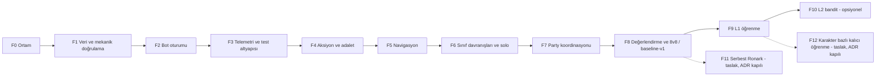

# 17 — Uygulama Yol Haritası ve Faz Kapıları

> Durum: Taslak v1.0 · Araştırma tarihi: 2026-10-01 · Referans commit: `0f52027`
> Faz durumu tanımları ve rapor şablonları: [21](21_PROJECT_TRACKING_TEMPLATES_AND_DOC_RULES.md). **Kod yazılmış olması bir fazın tamamlandığı anlamına gelmez**: faz ancak çıkış koşulları ölçülmüş kanıtla karşılandığında `KABUL_EDILDI` olur.
> Kimlikler: AC-* ilgili dokümanlarda, T-*/EVAL-* [15](15_TEST_ARENA_SCENARIOS_AND_ACCEPTANCE_CRITERIA.md)'te, ADR-* [21](21_PROJECT_TRACKING_TEMPLATES_AND_DOC_RULES.md) §4.3'te, Q-* ve R-* [18](18_RISKS_ASSUMPTIONS_AND_OPEN_QUESTIONS.md)'de.

---

## 1. Genel bakış

| Faz | Ad | Temel sürüm (MVP) | Tahmini çaba* |
|---|---|---|---|
| F0 | Ortam ve temel doğrulama | Evet | S |
| F1 | Veri ve mekanik doğrulama | Evet | M |
| F2 | Bot oturumu (soketsiz `CUser`) | Evet | M |
| F3 | Telemetri ve test altyapısı | Evet | M |
| F4 | Aksiyon yürütme ve adalet koruması | Evet | M |
| F5 | Navigasyon | Evet | M–L |
| F6 | Sınıf davranışları, hayatta kalma, solo | Evet | L |
| F7 | Party koordinasyonu | Evet | L |
| F8 | Değerlendirme harness'i, 8v8, `baseline-v1` dondurma | Evet | M |
| F9 | L1 offline parametre optimizasyonu | Hayır (sonraki) | M |
| F10 | L2 contextual bandit | Hayır (opsiyonel) | M |
| F11 | Serbest Ronark davranışları (taslak, ADR kapılı) | Hayır | L |
| F12 | Karakter bazlı kalıcı öğrenme (taslak, ADR kapılı; ADR-0030-DEG) | Hayır | M–L |
| U | Sürüm yükseltme: 1534 istemcisi, yeni Moradon, yeni klan sistemi (ADR-0068) | Hayır (paralel hat) | L |

\* S/M/L göreli büyüklüktür; takvim tahmini değildir.

Paralel yürütülebilir işler (kural 2'nin istisnası, [21](21_PROJECT_TRACKING_TEMPLATES_AND_DOC_RULES.md) §1): F3'teki `BotCore` birim test altyapısı F2 ile paralel; F5'teki navigasyon algoritmaları (`BotCore`, sunucusuz) F3–F4 ile paralel; analiz araçları (Python) her fazla paralel.

## 2. Fazlar

### F0 — Ortam ve temel doğrulama

| Alan | İçerik |
|---|---|
| Amaç | Depo, veri ve istemciyle tekrar üretilebilir çalışan bir test sunucusu; mevcut sorunların listesi |
| Kapsam | Derleme (Release + Debug), DB geri yükleme, ODBC/ini, üç sunucunun çalıştırılması, insan istemcisiyle Ronark'a giriş; KI-001..005 kaydı; Release/Debug farkları |
| Kapsam dışı | Kod değişikliği (yalnızca yapılandırma) |
| Ön koşullar | `start.md` kurulum notu; Client/DB/Map paketleri |
| Modüller | Tümü (yalnızca derleme) |
| Görevler | 1) Temiz kurulum betiği/notu 2) Release ve Debug derleme 3) T-ENV-01/02 4) `STATUS.md`, `KNOWN_ISSUES.md` başlat 5) Upstream PR #10 alınmaz (K-10, ADR-0013) |
| Teslimatlar | Kurulum notu, derleme kaydı, T-ENV kanıtları, `STATUS.md` |
| Test | T-ENV-01, T-ENV-02 |
| Kabul | Üç sunucu ayakta; insan istemcisi Ronark'a giriyor; Release/Debug fark tablosu var |
| Çıkış | Kabul + faz raporu |
| Riskler | DB/istemci sürüm uyumsuzluğu (VERSION tablosu), MSVC araç zinciri |
| Geri alma | Yok (yapılandırma) |
| Kanıt | Ekran görüntüsü/log, `STATUS.md` |

### F1 — Veri ve mekanik doğrulama

| Alan | İçerik |
|---|---|
| Amaç | [03](03_VERSION_COMPATIBILITY_AND_VERIFIED_MECHANICS.md)–[05](05_SKILL_CATALOG_AND_COMBAT_RULES.md)'teki `[D]`/`[A]` iddiaların çalışma zamanında doğrulanması; istemci zamanlama profilinin ölçülmesi; test verisi düzeltmeleri |
| Kapsam | Debug-only paket izleme loglayıcısı (gelen paketlerin opcode, zaman, alanları); MAGIC.Etc düzeltmesinin kalıcı betiği (ADR-0003); pot verisi değiştirilmez (K-5, ADR-0009); level 80 bot karakter kurulum betiği taslağı (ADR-0002); T-MECH-*, T-DATA-*; açık soruların (Q-01..) cevaplanması |
| Kapsam dışı | Bot kodu |
| Ön koşullar | F0 kabul |
| Modüller | [`GameServer/User.cpp`](https://github.com/ko4life-net/Fire-Drake-Project-v1453/blob/0f520272ae1f11472623d62bff76fff98562e7b3/GameServer/User.cpp) (`HandlePacket` girişinde debug log), DB betikleri, `tools/` |
| Görevler | 1) Paket izleyici (derleme bayrağıyla) 2) İnsan istemcisiyle warrior/priest/mage zamanlama kayıtları (T-MECH-CLIENT-01..04) 3) Tekil skill/pot/buff testleri (insan veya GM ile) 4) Hasar modeli ölçümü (T-MECH-DMG) 5) Arena doğrulaması (T-ENV-ARENA-01..04) 6) 03/05/11/12'de etiket yükseltme ve düzeltmeler |
| Teslimatlar | Ölçülmüş CLI-01..12 tablosu, güncellenmiş 03/05, DB düzeltme betikleri (geri alınabilir), arena koordinat raporu |
| Test | [15](15_TEST_ARENA_SCENARIOS_AND_ACCEPTANCE_CRITERIA.md) §4.1–4.2 |
| Kabul | Kritik açık soruların (18 §3'te "F1'de kapanmalı" işaretli olanlar) cevaplanması; CLI tablosunun ölçülmüş değerlerle doldurulması; tüm T-MECH testlerinin `TEST_EDILDI` olması |
| Çıkış | Kabul + 03'te "F1'de doğrulandı" etiketleri |
| Riskler | Gerçek istemci zamanlaması ölçülemezse CLI değerleri muhafazakâr kalır (R-07) |
| Geri alma | DB betikleri yedek tablodan geri yükler; paket izleyici derleme bayrağıyla kapalı |
| Kanıt | Test kanıt kayıtları, paket log örnekleri |

### F2 — Bot oturumu

| Alan | İçerik |
|---|---|
| Amaç | Soketsiz bot oyuncunun dünyaya girmesi, görünmesi, durması ve güvenle çıkması |
| Kapsam | S1 (ayrılmış slotlar), S2 (bot alıcısı), S3–S5 (giriş, zaman aşımı), S7 (yalnızca sabit IP; ranking/ödül/duyuruya dahil, K-9), S8 (`Update`), bot karakter kurulum betiği, `/bot spawn/despawn` (minimum) |
| Kapsam dışı | Karar verme; bot hareketsizdir |
| Ön koşullar | F1 (karakter kurulum betiği, DB düzeltmeleri) |
| Modüller | [`shared/KOSocketMgr.h`](https://github.com/ko4life-net/Fire-Drake-Project-v1453/blob/0f520272ae1f11472623d62bff76fff98562e7b3/shared/KOSocketMgr.h), [`shared/KOSocket.h`](https://github.com/ko4life-net/Fire-Drake-Project-v1453/blob/0f520272ae1f11472623d62bff76fff98562e7b3/shared/KOSocket.h), `GameServer/User.h/.cpp`, [`GameServer/CharacterSelectionHandler.cpp`](https://github.com/ko4life-net/Fire-Drake-Project-v1453/blob/0f520272ae1f11472623d62bff76fff98562e7b3/GameServer/CharacterSelectionHandler.cpp), [`GameServer/GameServerDlg.cpp`](https://github.com/ko4life-net/Fire-Drake-Project-v1453/blob/0f520272ae1f11472623d62bff76fff98562e7b3/GameServer/GameServerDlg.cpp) ([02](02_REPOSITORY_ANALYSIS_AND_INTEGRATION_MAP.md) §11) |
| Görevler | 1) Slot ayırma 2) `m_botSink` + `Send` geçersiz kılma 3) Giriş akışı taklidi 4) Çıkış akışı 5) `Update` çağrısı 6) Bot karakterlerin DB'ye yazılması (6 profil × 2 ulus) |
| Teslimatlar | Kod, kurulum betiği, ADR-0001 kabul |
| Test | AC-ARCH-01, AC-ARCH-04, AC-ARCH-05, T-PERF-06 (spawn/despawn 1000), T-PERF-05 (bot kapalı regresyon) |
| Kabul | 16 bot spawn; insan istemcisi botları doğru sınıf/ırk/ekipmanla görüyor; 1000 spawn/despawn döngüsünde çökme ve slot sızıntısı 0; çıkışta DB kaydı tam |
| Riskler | R-CODE-01 (kilitsiz harita kopyaları), R-CODE-02 (çıkış kaydı yarışı) |
| Geri alma | Bot sistemi bayrakla kapalı; değişiklikler ayrı commit'ler |
| Kanıt | Paket kaydı, ekran görüntüsü, dayanıklılık logu |

### F3 — Telemetri ve test altyapısı

| Alan | İçerik |
|---|---|
| Amaç | Her sonraki fazın ölçülebilir olması |
| Kapsam | Telemetri kuyruğu + yazıcı thread ([16](16_TELEMETRY_DEBUGGING_AND_PERFORMANCE.md)); `ScenarioRunner` (senaryo YAML, envanter doldurma, maç başlat/bitir); `+bot`/`/bot` komutları; `BotCore` statik kütüphane + birim test projesi; Python analiz aracı (JSONL → metrikler, harita izi) |
| Kapsam dışı | Davranış |
| Ön koşullar | F2 |
| Modüller | `GameServer/Bot/Telemetry*`, `ScenarioRunner`, `ChatHandler.cpp` (komutlar) |
| Görevler | 1) Olay şeması ve yazıcı 2) MATCH_START/END ve PERF_SAMPLE 3) Senaryo dosyaları 4) Komutlar 5) Birim test çatısı 6) Analiz aracı |
| Teslimatlar | Kod, araç, örnek rapor |
| Test | Sahte olaylarla yük testi; telemetri açıkken/kapalıyken tick süresi farkı |
| Kabul | `decisions` seviyesinde 16 bot için telemetri ek maliyeti MET-PERF-02'nin %10'unu geçmez; düşürülen olay sayacı çalışıyor; analiz aracı örnek maçtan MET tablosu üretiyor |
| Riskler | Disk G/Ç |
| Geri alma | Telemetri seviyesi `off` |
| Kanıt | Örnek JSONL ve rapor |

### F4 — Aksiyon yürütme ve adalet koruması

| Alan | İçerik |
|---|---|
| Amaç | Botların tüm temel aksiyonları **gerçek handler'lar üzerinden** ve CLI sınırları içinde yapabilmesi |
| Kapsam | `BOT_TICK` IOCP olayı (ADR-0005; **F2-02'de eklendi**, burada yalnızca kullanılır); `ActionExecutor` (Move, Stop, Attack, CastStart/Effect, UsePotion, Sit, Regene, Party, Chat, TargetHpReq); sonuç eşleme; `BotFairnessGuard` (CLI-01..12); `Perception` (gözlem sözleşmesi); betikli "test botu" ile T-MECH-SKILL'in bot tarafından yeniden çalıştırılması **Genişletme (ADR-0018, 2026-10-02):** cast iptali, uçan/çift tipli/Type4/alan skill'leri, cure/summon/eşya tüketen skill'ler için ilk dilimler, CLI-12, envanter doldurma, T-MECH-SKILL botla yeniden koşusu ve algı eksikleri de F4 kapsamındadır; bunlar bitmeden F4 tamamlanmış sayılmaz. |
| Kapsam dışı | Akıllı karar (betikli test dizileri) |
| Ön koşullar | F1 (CLI tablosu), F3 |
| Modüller | [`shared/SocketDefines.h`](https://github.com/ko4life-net/Fire-Drake-Project-v1453/blob/0f520272ae1f11472623d62bff76fff98562e7b3/shared/SocketDefines.h), [`shared/SocketMgr.cpp`](https://github.com/ko4life-net/Fire-Drake-Project-v1453/blob/0f520272ae1f11472623d62bff76fff98562e7b3/shared/SocketMgr.cpp), `GameServer/Bot/*` |
| Görevler | 1) Olay tipi ve dağıtım 2) Paket oluşturucular 3) Cast zamanlaması 4) Fairness kuralları 5) Perception ve sözleşme denetimi 6) Betikli test senaryoları |
| Teslimatlar | Kod; T-MECH-SKILL-* bot kanıtları |
| Test | Betikli testler; MET-ACT-02; MET-FAIR-01; AC-LRN-03 statik/çalışma zamanı denetimi |
| Kabul | Betikli dizilerde sunucuya giden geçersiz aksiyon ≤ %1; fairness ihlali (sunucuya ulaşan) 0; sözleşme dışı algı erişimi 0; tick bütçesi içinde |
| Riskler | Kripto/hesap kapılarının bot için yanlış ayarlanması |
| Geri alma | Bot sistemi kapalı |
| Kanıt | Test kanıt kayıtları |

### F5 — Navigasyon

| Alan | İçerik |
|---|---|
| Amaç | Takılmayan, yürünebilirlik kurallarına uyan hareket |
| Kapsam | [12](12_NAVIGATION_AND_POSITIONING.md) §2–§10: katmanlar, A*, düzleştirme, hareketli hedef, ulaşılamaz tespiti, güvenli nokta, tehlike bölgeleri, formasyon, takılma kurtarma, LoS (advisory) |
| Kapsam dışı | Navmesh (ADR-0006 gerekirse) |
| Ön koşullar | F4 (hareket aksiyonu), T-NAV-01/02 ölçümleri (F1) |
| Modüller | `GameServer/Bot/Nav/*`, `BotCore` |
| Test | T-NAV-03..08, T-NAV-LOS-01 |
| Kabul | AC-NAV-01..06 |
| Riskler | 4 m çözünürlüğün dar geçitlerde yetersizliği (R-09) |
| Geri alma | Önceki nav sürümü (parametre ile seçilebilir) |
| Kanıt | Takılma ısı haritası, yol bulma süre dağılımı |

### F6 — Sınıf davranışları, hayatta kalma ve solo

| Alan | İçerik |
|---|---|
| Amaç | Her rol profilinin tek başına doğru oynaması; `B0-NAIVE` baseline'ı |
| Kapsam | Ortak FSM ([13](13_BOT_ARCHITECTURE_AND_DATA_MODEL.md) §6); warrior ([06](06_WARRIOR_BEHAVIOR.md)), priest (kendi/tek müttefik), mage (summon hariç) davranışları; [11](11_RESOURCE_POTION_AND_SURVIVAL_MANAGEMENT.md) pot ve geri çekilme; [10](10_SOLO_PK_BEHAVIOR.md) solo; karar logu |
| Kapsam dışı | TeamBlackboard, çağrılar, summon |
| Ön koşullar | F5 |
| Test | T-WAR-*, T-PRI-01/02/07, T-MAG-01..04, T-SUR-*, T-POT-*, T-SOLO-*, EVAL-1v1 |
| Kabul | AC-WAR-01..05, AC-PRI-01/02, AC-MAG-01..03, AC-SUR-01..05, AC-SOLO-01..05; L0 politikası B0-NAIVE'i EVAL-1v1'de anlamlı yener |
| Riskler | Hasar modeli sapması; CLI değerlerinin yanlışlığı |
| Geri alma | Politika parametreleri ve rol modülleri bayrakla |
| Kanıt | 1v1 matris raporu, karar logu örnekleri |

### F7 — Party koordinasyonu

| Alan | İçerik |
|---|---|
| Amaç | [09](09_PARTY_COORDINATION_AND_TARGET_SELECTION.md)'un tamamı |
| Kapsam | Party kurulumu, roller, liderlik, TeamBlackboard, hedef skoru, heal-stall kararı, debuff çağrısı + chat, iki priest koordinasyonu, buff matrisi, cure, diriltme, summon akışı ([08](08_MAGE_BEHAVIOR.md) §8), regroup/retreat, tam yenilgi |
| Ön koşullar | F6 |
| Test | T-PTY-*, T-PRI-03..06/08, T-MAG-05/06, EVAL-2v2..5v5 |
| Kabul | AC-PTY-01..07, AC-PRI-03..08, AC-MAG-04/05, AC-WAR-04/06 |
| Riskler | Durum salınımı; chat'in istemcide karakter sorunları |
| Geri alma | Takım modu kapalı (solo davranışa düşüş) |
| Kanıt | Küçük takım raporları |

### F8 — Değerlendirme harness'i, 8v8 ve `baseline-v1`

| Alan | İçerik |
|---|---|
| Amaç | Kilitli değerlendirme seti, rakip profilleri, istatistik ve ilk insan oturumu; `baseline-v1`'in dondurulması |
| Kapsam | `evalset-v1`, OP-* profilleri, arena A ve taraf değişimi otomasyonu, SPRT/Wilson/bootstrap raporu, T-PERF-01..04, insan değerlendirme formu |
| Ön koşullar | F7 |
| Test | EVAL-*, T-PERF-*, insan oturumu |
| Kabul | AC-EVAL-01..03; AC-ARCH-02/03; T-PERF-01/03 bütçe içinde |
| Çıkış | `baseline-v1` politika dosyası dondurulur (ADR) — **temel sürüm (MVP) tamamlanır** |
| Riskler | Yetersiz tekrar kapasitesi (R-10) |
| Geri alma | — |
| Kanıt | Değerlendirme raporu, insan formları |

### F9 — L1 offline parametre optimizasyonu (temel sonrası)

| Alan | İçerik |
|---|---|
| Amaç | [14](14_LEARNING_AND_ADAPTATION.md) §3 L1 |
| Kapsam | Eğitim havuzu, parametre arama (random search → CMA-ES), PolicyStore sürümleme, canary, otomatik geri alma |
| Test | AC-LRN-01..06 |
| Çıkış | En az bir rol profilinde baseline'ı SPRT ile geçen politika veya "iyileşme yok" kanıtı (her ikisi de geçerli sonuç) |

### F10 — L2 contextual bandit (opsiyonel)

[14](14_LEARNING_AND_ADAPTATION.md) §12. Ön koşul F9 kabulü. Başlatma ADR gerektirir.

### 2.1 Aksiyon desteği matrisi ve davranış zinciri (değerlendirme 2026-10-02, ADR-0018 ile eşlenmiş)

Ana hat F4'ü [ADR-0018](adr/ADR-0018-f4-kapsam-genisletme-aksiyon-destegi.md) ile genişletti: aksiyon desteğinin tamamlanması F4'ün parçasıdır, dilimler **m.1..m.10** sırasıyla ana hat döngüsünce F4-24 ve sonrası olarak yazılır/uygulanır. Bu bölüm **plan kimliği ayırmaz**; davranışlardan geriye giderek hangi dilimin hangi davranış için ön koşul olduğunu eşler. Bugün `ActionExecutor` yalnızca tek hedefli, uçmayan, eşyasız Type1/Type3 skill'i kabul eder (`GameServer/Bot/ActionExecutor.cpp:721-729`; diğerleri `unsupported_skill`). Zincir: **davranış → gerekli skill → aksiyon desteği → algı ihtiyacı → oyun içi kabul testi** (`docs/15` §4.9).

ADR-0018 dilimleri: **m.1** cast iptali/hareketle iptal/`UseStanding` otomatik durdurma · **m.2** uçan skill · **m.3** çift tipli Type3 (`bType[1] != 0`) · **m.4** Type4 buff/debuff · **m.5** alan skill (CLI-07) · **m.6** Type5+/summon/eşya tüketen skill'ler için ilk dilimler · **m.7** CLI-12 (F4-38 KAPANDI) · **m.8** envanter doldurma/yeniden stoklama (ADR-0018 Ek 16; F4-40 HAZIR: `db/004` + `tools/bot-refill.sh`, sunucu kodu yok) · **m.9** T-MECH-SKILL botla koşusu (ADR-0018 Ek 17; F4-41 HAZIR: ölçüm altyapısı + `tools/skill-check.py`, koşu F4-42) · **m.10** algı eksikleri (başkalarının oturma bayrağı, `PARTY_LEVELCHANGE`/`STATUSCHANGE`). · **m.11** paket izleyici genişletme (ADR-0018 Ek 2/15; F4-39 KAPANDI; CLI-14..CLI-20 insan ölçümlerini açar, dilim sırasından bağımsız).

| Davranış | Gerekli skill (`docs/05`) | Bugün | ADR-0018 dilimi (en geç faz) | Algı ihtiyacı | Oyun içi kabul |
|---|---|---|---|---|---|
| Warrior baskı | Type1 (Carving, sword dancing...), R | ✔ | — | konum ✔; düşman HP: F4-51 | T-IGT-WAR-01 |
| Warrior sprint, Outrage/Frenzy (Type4 self), restoration/Regeneration (Type3 HoT self) | Type4 self, Type3 self | ✘ (`bType[0]=4` reddedilir) | **m.4** (F6'dan önce) | self buff listesi ✔ (F4-17) | T-IGT-WAR-01, T-SUR-01 |
| Warrior kontrol (Scream, Shock Stun) | Type1 + stun; Stone of Warrior (`iUseItem`) | ◐ F4-37 HAZIR (`{1, 4}`/`{1, 3}` çift tip kapısı açılır: Scream, Shock Stun, Exceed Break, leg cutting; eşya kapısı F4-36 ile açıldı, ADR-0018 Ek 12/13; karar katmanı F6) | **m.6f** (F7 healer geçişinden önce) | düşman durumu: F4-53 | T-IGT-PTY-01 |
| W-G peel: descent (Type8 warp), Binding/provoke (Type7, MB-10) | Type8 warp 25, Type7 | ✘ | **ADR-0018'e eklenmeli** (Type8 warp/descent; Type7 opsiyonel, Q-22) | party konumları ✔ | T-WAR-06, AC-WAR-04/06 |
| Priest tek hedef heal | Type3 dost tek | ✔ (`MORAL_FRIEND_WITHME`, ad ile) | — | party HP ✔ (F4-18) | T-IGT-PRI-01 |
| Priest grup heal (112557/112560, party hedefi r=30) | Type3 party/alan | ✘ | **m.5** (party hedefi çözümü açıkça yazılmalı, aşağıda) | party konumları ✔ | T-PRI-03 |
| Priest buff (AC/HP/direnç) | Type4 dost | ✘ | **m.4** (F7'den önce) | dost buff gözlemi: F4-52/53 | T-PRI-04 |
| Priest cure | Type5 (REMOVE_TYPE4/disease) | ◐ F4-32 KAPANDI (Cure curse/disease, `Moral` 2; Bless of God `Moral` 6 kapalı) | **m.6a** (F7'den önce) | dost debuff gözlemi: F4-53 | T-PRI-05 |
| Priest diriltme | Type5 + Stone of Life (`iUseItem`) | ◐ F4-33 KAPANDI (Resurrection love/grace/favors, `Moral` 25; taşlar **ölü hedeften** alınır, botlarda 30 adet var) | **m.6b** (F7'den önce); taş yeniden stoklaması m.8 | ceset (`WIZ_DEAD` ✔), ölü hedefin taş stoğu (`TeamBlackboard`; insan oyuncuda bilinmez) | T-PRI-08 |
| Priest debuff + hedef çağrısı | Type4 düşman (Malice/Parasite) | ◐ F4-28 KAPANDI (tek hedef, `Moral` 7; hedef çağrısı/provoke ayrı) | **m.4** (F7'den önce) | debuff başarısı: F4-52; düşman durumu: F4-53; düşman adı: F4-50 | T-PRI-06 |
| Priest'e baskı: cast kesme/geri çekilme | cast iptali | ✘ | **m.1** | düşman konum+hız: F4-50 | T-PRI-07 |
| Mage tek hedef, uçmayan, tek tipli Type3 | Type3 düşman (Ignition) | ✔ | — | düşman HP: F4-51 | T-MAG-01 |
| Mage uçan büyü (Fire ball, Ice arrow...) | Type3 uçan | ◐ tek tipli Type3 uçan ✔ (F4-25: Fire ball/Fire spear/Static orb); çift tipli uçan (Ice arrow/orb) F4-26 | **m.2** ✔ + **m.3** (F6'dan önce) | düşman konum+hız: F4-50 | T-MAG-01/02 |
| Mage çift tipli Type3 (buz büyüleri, Prismatic) | Type3 `bType[1] != 0` | ✔ F4-26 KAPANDI (`{3, 4}` çifti, tek hedef; alan/`UseItem` çiftleri hariç) | **m.3** (F6'dan önce) | — | T-MAG-02 |
| Mage/priest eşyalı sınıf skill'leri (Impact `110557`/`110657`/`110757`, Absolute power `110802`, Judgment `112802`) | Type3/4/1 + sınıf taşı/scroll (`iUseItem`) | ◐ F4-36 KAPANDI (eşyalı sınıf skill'i kapısı `CastItemSkillSupported` + `no_item` ön kontrolü; scroll'lar tüketilmez, sınıf taşları atışta 1 azalır, ADR-0018 Ek 12; çift tipli Scream/Shock Stun F4-37'de) | **m.6e** (F7'den önce) | düşman konum/HP: F4-50/51; kendi taş stoku: F4-17 genişletmesi gerekebilir | T-MAG-01/02, T-IGT-PRI-01 |
| Mage alan büyü (Fire burst, Supernova, ice storm) | Type3 alan, hedef noktası | ◐ F4-29 KAPANDI (`Moral` 10, uçmayan: Inferno, Supernova, Blizzard, Frost nova); F4-30 HAZIR (uçan alan: Fire/Ice/Thunder burst) | **m.5** (CLI-07; F6'dan önce) | düşman kümesi: F4-50 | T-MAG-02 |
| Mage summon (Type8 friend) + Gate | Type8 | ◐ F4-34 KAPANDI (summon friend `110004`/`210004`, `Moral` 4 `WarpType` 12; güvenlik kapıları SUM-01..07 F7'de, ADR-0018 Ek 10); F4-35 KAPANDI (Gate `110015`/`210015` `Moral` 1 `WarpType` 1 ve descent `106650`/`206650` `Moral` 4 `WarpType` 25, ADR-0018 Ek 11; Escape (Ronark'ta sunucuca engelli), Blink (`SkillLevel 80`) ve Wild advent kapalı) | **m.6c** summon ✔ + **m.6d** Gate/descent (plan, F7'den önce) | yaşayan/yeniden doğmuş üye (`WIZ_USER_INOUT` respawn ✔ F4-12, party ✔) | T-IGT-MAG-01 |
| Botun insanla aynı hız denetimine tabi olması (CLI-12) | `WIZ_SPEEDHACK_CHECK` (otomatik istemci trafiği) | ◐ F4-38 KAPANDI (her 10,0 sn paket, sonuç `WIZ_WARP` yankısından; `[BOT] SPEEDHACK_CHECK`; ADR-0018 Ek 14, `docs/03` MEC-MOV-09) | **m.7** (F5 yürüyüş entegrasyonundan önce) | — | T-MECH-CLIENT-04 |
| Pot ve envanter (pot/taş/scroll doldurma) | `UsePotion` | ✔ kullanım; doldurma ✘ | **m.8** | self stok ✔ | T-POT-01..03, `ScenarioReset` |
| Beceri doğrulaması (T-MECH-SKILL) | tüm çekirdek | — | **m.9** | — | T-MECH-SKILL-* |

**ADR-0018'e eklenmesi önerilenler** (ADR değiştirilmedi; ana hat çalışıyor):

1. **m.6 belirsiz:** "ilk dilim(ler)" Type5 cure, diriltme (Stone of Life), summon (Type8 + güvenlik koşulları), Type8 warp/descent/Gate ve `UseItem` tüketimini (sınıf taşları `BeforeAction`, Stone of Warrior/Priest) ayrı dilimlere bölmeli ve **F7'den önce** tamamlamalı.
2. **m.5:** party hedefli skill'ler (group heal/group buff: `bMoral` party türleri) için hedef çözümü (party üyeleri algıdan, ad/kimlik seçimi) alan skill'lerinden ayrı ve açık yazılmalı.
3. **Type7** (Binding/provoke, MB-10, Q-22): W-G peel için gerekip gerekmediği kararı (opsiyonel).
4. **m.2 ile m.5** ilişkisi: mage'in ana alan skill'leri (110533 Fire burst) hem uçan hem alandır; FLYING fazı (`docs/03` §13.2: CASTING → FLYING → EFFECTING, ~1 sn uçuş) iki dilimde tutarlı kurulmalı.
5. **m.8:** pot yanında taş/scroll doldurma ve `ScenarioReset` (`docs/15` §6a) ile ortak sözleşme (başlangıç doğrulaması).
6. **m.10 algı eksikleri** yalnızca oturma bayrağı ve seviye/sınıf değişimi değildir; bu değerlendirme F4-50 (ad, konum yaşı, hız, geçmiş), F4-51 (düşman HP tablosu), F4-52 (skill olay halkası), F4-53 (gözlenen durum, saf mantık, HAZIR; sunucu bağlaması F4-60) ve F4-54 (tek yönlü görüş teşhisi, KI-DEG-01) planlarını ayrıca yazdı: ADR-0018 m.10 bunlarla eşlenmeli.
7. **Kabul bağlantısı:** her dilimin oyun içi kabulü (`docs/15` §4.9 T-IGT-*) ve faz kapısı (G4, bu belge §5) açıkça bağlanmalı.

### F11 — Serbest Ronark davranışları (TASLAK, ADR kapılı)

| Alan | İçerik |
|---|---|
| Amaç | Proje hedefinin tamamı (`docs/01` §1): Ronark Land'de kontrolsüz ortamda, insan oyunculara ve diğer botlara karşı solo/party PK. Kontrollü arena (F0–F8) bu hedefin ölçülebilir ilk adımıdır |
| Kapsam | **F11-a güvenli konuma çekilme** (kendi tower halkası, dost konumu veya düşmansız bölge: `docs/11` §4.3 serbest mod metni; `Safe` bayrağı F5-06/F5-07), **F11-b yeniden gruplanma** (dağılmış party'nin arena dışında, harita genelinde regroup noktasında toplanması, üçüncü taraf/canavar), **F11-c savaşa dönüş** (düşmanın konumu bilinmiyor: arama, yeniden giriş kriterleri, takip sınırı); ROAM ve çatışma arama (`P-SOLO-ROAM-ROUTE`; **bowl:** iki ırkın savaşacak insan/takım ararken dönüp dolaştığı harita merkezi, ≈ (1024, 1024) r ~150 m, `docs/12` §1: canavar yoğun (yürürken saldırırlar, `danger_static` ve tetikleme menzilleri) ve engel/takılma noktası çok; F11 rota ve takılma kurtarma tasarımı bunu girdi alır, T-NAV-12), çatışmaya girme/girmeme kararı; ≥ 24 saat çalışma: kendini kurtarma (takılma, stok, NP 0 / KI-013, ölüm döngüsü), ikmal yok → STK-04; canlı insanlara etki: sıralama/NP/ödül (K-9), chat sınırı, `+bot pause`; insan+bot karma party. Arena modundaki geri çekilme/dönüş sonuçları (ADR-0033-DEG) **bunların yerine geçmez** |
| Kapsam dışı | Diğer zone'lar, savaş etkinlikleri, rogue/archer (`docs/01` §2): ayrıca ADR |
| Ön koşullar | F8 kabulü (`baseline-v1`), F9 sonucu (iyileşme var/yok), **yeni ADR: A-03 kapsam kararı** (hangi insanlar, hangi gözetim/geri alma), Q-14 sonrası AIServer ilişkisi, canavar/guard tower etkileşimi |
| Testler (öneri) | T-FREE-01 çatışma arama süresi, T-FREE-02 sayısal dezavantajda kaçış, T-FREE-03 ≥ 24 sa dayanıklılık, T-FREE-04 insan değerlendirmesi (kör test), T-FREE-05 üçüncü taraf/canavar, **T-FREE-06** güvenli konuma çekilme (HP < %30'da güvenli noktaya varış süresi, yolda ölüm oranı, MET-SUR-01/03), **T-FREE-07** yeniden gruplanma (dağılmış party'nin regroup noktasında ≥ %75 toplanma süresi, MET-PTY-04 serbest harita), **T-FREE-08** savaşa dönüş (düşman bulma süresi, yeniden giriş sonrası ilk 20 sn hayatta kalma, MET-SUR-02/07) |
| Kabul | AC-FREE-01..08 (F11 planlanırken yazılır); insan oyuncu rahatsızlık/şikâyet göstergesi; sistem kapalıyken sıfır etki (AC-ARCH-02) |
| Riskler | R-08, A-03, canlı oyuncu güvenliği, R-11 |
| Geri alma | `/bot disable`, bayrak, F8 baseline'a dönüş |
| Durum | **TASLAK:** ADR olmadan plan yazılmaz |

### F12 — Karakter bazlı kalıcı öğrenme (TASLAK, ADR kapılı; ADR-0030-DEG)

| Alan | İçerik |
|---|---|
| Amaç | Her karakterin **kendi maç geçmişinden kalıcı olarak** gelişmesi (nihai hedefin parçası, proje sahibi kararı 2026-10-02); rol politikasını bozmadan |
| Kapsam | (1) Karakter politika dosyası: rol politikası sürümüne referans + sınırlı sapma `δ_c` (kapalı parametre listesi `docs/14` §4, izinli aralığın alt bandı, rol politikasına çekilme λ); (2) karakter başına deneyim kaydı (telemetri: `MATCH_END`, karar sonuçları, ödül bileşenleri; yalnızca bot verisi); (3) güncelleme yöntemi (L1/L2'nin karakter düzeyi türü, ADR-0008 sonrası) ve minimum maç sayısı eşiği; (4) `PolicyStore` karakter anahtarlı sürümleme, canary, otomatik geri alma (`δ_c = 0`); (5) öğrenme eğrisi raporu (aynı karakterin ilk N vs sonraki N maçı), A/B rakip havuzu ayrımı |
| Kapsam dışı | İnsan oyunculara özel model (`docs/14` §13), karakterler arası politika paylaşımı (rol politikası zaten ortak), RL/taklit öğrenme |
| Ön koşullar | F9 kabulü (PolicyStore, canary, rollback, evalset; F9 "iyileşme yok" ise ayrı ADR), F8 harness, kararlı karakter kimliği (`BOT_TABLE`/DB), değerlendirme kapasitesi (R-10) |
| Kabul | **AC-CHR-01** sapma izinli aralık dışına çıkamaz (yüklemede reddedilir, birim); **AC-CHR-02** karakter politikası rol politikasını kilitli evalset'te SPRT ile geçmeden etkin olmaz, geçemeyende `δ_c = 0`; **AC-CHR-03** geri alma: guard metrikleri bozulunca karakter→rol politikasına otomatik dönüş (oyun içi canary ≤ 10 dk); **AC-CHR-04** tekrarlanabilirlik (aynı dosya + seed → istatistiksel aynı sonuç); **AC-CHR-05** bireysel gelişim kanıtı: aynı karakterin sonraki N maçı ilk N maçından kilitli sette anlamlı iyi **veya** "iyileşme yok" kanıtı, yeni rakip profillerinde genelleme; **AC-CHR-06** insan değerlendirmesi: karakterler arası davranış farkı gözlenebilir ve zararsız |
| Riskler | Aşırı uyum, veri azlığı (karakter başına maç), karakter sayısı × test matrisi, ödül sömürüsü |
| Geri alma | Tüm karakterlerde `δ_c = 0` (dosya işaretçisi) |
| Durum | **TASLAK:** F9 sonrası; ADR olmadan plan yazılmaz; F10/F11'den bağımsız |

### U — Sürüm yükseltme: 1534 (Moradon: The Resurrection) — ADR-0068

| Alan | İçerik |
|---|---|
| Amaç | Sunucuyu ve botları AlphaGame paketiyle gelen 1534 istemcisiyle (yeni Moradon, Squire/Knight/Royal klan kademeleri, uzun pelerin) çalışır hale getirmek; bot davranışını ve doğrulanmış mekanikleri bozmadan |
| Taban | Bizim kaynak kod (seçenek A, ADR-0068). AlphaGame kaynağı (`C:\dev\fdp1534\alpha`) ve DB'si (`.\SQL2019` → `FDP_alpha1534`) yalnız referans |
| Alt fazlar | **U1** protokol profili ve paket düzenleri (`[PROTOCOL] CLIENT_VERSION`, kripto anahtarı, giriş sunucusu, istemcinin beklediği sunucu→istemci düzenleri, BotCore ayrıştırıcıları); **U2** veri (VERSION, pelerin tablosu `Cloak.tbl` 224 satır ile eşleşme, yeni eşya/NPC satırları; eklemeli `db/0xx` + rollback); **U3** yeni Moradon (SMD istemcinin `moradon.gtd`/`.opd` dosyalarından üretilir, ALPHA yalnız warp/nesne bağışçısı — ADR-0068 Ek 2; ZONE_INFO/START_POSITION/K_OBJECTPOS/K_NPCPOS; 6 SMD'de Moradon'a giren warp hedefleri; geçişte ayrı 1534 DB'si); **U4** klan sistemi (kademe/pelerin kuralları, RGB, `[CLAN_GRADE]`); **U5** regresyon ve kapanış |
| Kapsam dışı | AlphaGame sunucusunu/AIServer'ını olduğu gibi almak; MAGIC/MAGIC_TYPE* değerlerini değiştirmek (ayrı karar); pet sistemi; AlphaGame'in ek sistemleri (Genie, VIP depo, balıkçılık/madencilik, mühür) — her biri ayrı ADR |
| Ön koşul | Hedef istemci `C:\dev\fdp1534\client` (Defender temiz); SQL Server 2019 referans örneği kurulu (2026-10-08) |
| Kabul | **T-UPG-01** 1534 istemcisiyle giriş → karakter listesi → oyuna giriş, paket izleyicide bilinmeyen opcode 0; **T-UPG-02** yeni Moradon yükleme/yürüme 30 dk çökme 0; **T-UPG-03** klan kademe + uzun pelerin uçtan uca (insan testi); **T-UPG-04** bot regresyonu (`run-tests.sh`, 8v8 ve dolaşım senaryoları U öncesiyle aynı); **T-UPG-05** `CLIENT_VERSION=1453` ile eski istemci aynı derlemeyle çalışır |
| Riskler | R-UPG-03 istemci tablosu ↔ DB kimlik uyumsuzluğu; R-UPG-05 istemcinin beklediği paket düzeni (çalışma zamanında doğrulanacak); yeni Moradon SMD onarımı |
| Geri alma | `[PROTOCOL] CLIENT_VERSION=1453` + eski istemci; `db/0xx_*_rollback.sql` |
| Durum | **GELİŞTİRİLDİ, insan testi bekliyor** (2026-10-08): U1-01..07, U2-01/02, U3-01/02 DOĞRULANDI/KAPANDI (`yukseltme/1534`); duman koşuları temiz (`docs/reports/u0-1534/F-duman-kosusu-2026-10-08.md`). Kalan: T-UPG-01/02/03 insan testi; U4 (klan kademe yükseltme kuralı ve Squire/Knight/Royal görevleri — görev stratejisi kararıyla); 1534 görev tablosu (QUEST_HELPER 552 kimlik çakışması) |

## 3. Temel sürüm ve sonraki geliştirmeler

| Temel sürüm (F0–F8) | Sonraki (kapsam büyümesi ADR ile) |
|---|---|
| Warrior, priest, mage; 6 profil | Lightning mage profili; rogue/archer |
| Ronark Land, test arenası A | Canlı Ronark (rastgele insanlarla); diğer PK zone'ları |
| S0–S2 referans ekipman | Set item'ları, transform, ileri profiller (Etc 510–523 skill'leri, Q-04 sonrası) |
| L0 baseline | L1 (F9), L2 (F10), L3 araştırma |
| Pot ikmali yok (stok senaryoda) | Zone dışına ikmal yolculuğu |
| Arena içi regroup, geri çekilme, savaşa dönüş (F7) | Serbest dolaşma, çatışma arama, ≥ 24 sa çalışma (F11, ADR kapılı) |

## 4. Faz kapısı denetim listesi (her faz için)

- [ ] Faz kapsamındaki tüm iş kalemleri `GELIŞTIRILDI`
- [ ] İlgili tüm testler çalıştırıldı (`TEST_EDILDI`) ve kanıt kayıtları var
- [ ] Her kabul kriteri ölçülen değerle eşlendi
- [ ] Yeni bilinen sorunlar `KNOWN_ISSUES.md`'de
- [ ] Etkilenen dokümanlar güncellendi, etiketler yükseltildi ([21](21_PROJECT_TRACKING_TEMPLATES_AND_DOC_RULES.md) §5)
- [ ] [20](20_REQUIREMENTS_TRACEABILITY_MATRIX.md) güncellendi
- [ ] Geri alma yolu test edildi (bayrakla kapatma)
- [ ] Faz sonuç raporu yazıldı ve onaylandı
- [ ] İlgili davranış **oyun içinde** çalıştı ve kanıtı var (§5 G-IGT, `docs/15` §4.9); yalnızca derleme/birim testi yeterli değildir
- [ ] Bireysel planların `KAPANDI` olması ile fazın `KABUL_EDILDI` olması ayrı izlenir (`docs/STATUS.md` "Faz kabul takibi")

## 5. Oyun içi kabul kapıları (G-IGT, değerlendirme 2026-10-02)

Önerilen ilerleyiş (faz sırası değişmez; F6 ve F7 alt kapılara bölünür). Bir alt kapı, listelenen planlar `KAPANDI` **ve** oyun içi kabul testi geçmeden `KABUL_EDILDI` olmaz. Faz kapısı denetim listesi (§4) her alt kapıya uygulanır.

| Kapı | Kapsam | Planlar / ön koşul | Oyun içi kabul (`docs/15` §4.9) | Yöntem sınırı |
|---|---|---|---|---|
| G4 F4 paket ve algı doğruluğu | Aksiyon + algı + betikli testler | F4-01..F4-23 KAPANDI; **ADR-0018 dilimleri m.1..m.10** (F4-24 ve sonrası, ana hat); F4-50..F4-54 (bu değerlendirme); F4-18 zaten kapandı | betikli koşuda MET-ACT-02 ≤ %1, fairness ihlali 0; `/bot snap` düşman HP/ad/olay/durum alanları sunucu `list` ile çapraz; `ObsTable` simetrisi (F4-54) | Çalışma zamanı doğrulamasını Claude yapar |
| G5 F5 gerçek harita | Navigasyon `BotCore` + sunucu entegrasyonu | F5-01..F5-07, F5-08..F5-10, F5-50..F5-55 | T-NAV-04/05/09, AC-NAV-01..07 çalışma zamanında; engelli hücreye giren hareket 0 | F5 yalnız `BotCore` olarak kapanamaz (docs/12 §13.6) |
| G6a Warrior | Warrior solo (sprint/Type4 self dahil) | F5 kabulü; ADR-0018 m.4 | T-IGT-WAR-01 | solo, arena A |
| G6b Priest tek | Priest kendine/tek müttefike heal, pot | G6a veya paralel | T-PRI-01/02/07 | solo + 1 müttefik |
| G6c Mage saldırı | Mage tek hedef + uçan/çift tipli/alan | ADR-0018 m.2, m.3, m.5 | T-MAG-01..04 | summon yok |
| G7a Priest destek | Buff, cure, debuff, diriltme, iki priest | ADR-0018 m.4, m.6, m.8; F4-52/53 | T-IGT-PRI-01, T-PRI-03..06/08 | küçük takım |
| G7b Mage summon | Güvenli summon akışı | ADR-0018 m.6 (summon dilimi), G6c | T-IGT-MAG-01 | küçük takım |
| G7c Takım | Ortak hedef, debuff çağrısı, healer'a geçiş, regroup/geri çekilme | G7a, G7b | T-IGT-PTY-01, T-IGT-SUR-01, T-PTY-* | 2v2..5v5 |
| G8 8v8 ve baseline | Sıfırlanabilir, tekrarlanabilir değerlendirme | `db/005` (16 karakter, F8-03) ve `db/006` (+4 çeşitlilik, F8-04; ulus başına 10, toplam **20**; `docs/15` §6a; `db/003` zaten bot quest betiğidir), `ScenarioReset` (§6a, ADR-0032-DEG), `win_rule` türleri (§6b, ADR-0031-DEG), `evalset-v1` | T-IGT-EVAL-01, AC-EVAL-01..03 | MVP sonu |
| G9 öğrenme | L1 | G8 | AC-LRN-01..08 | "iyileşme yok" geçerli |
| G11 serbest Ronark | F11 (güvenli konuma çekilme, yeniden gruplanma, savaşa dönüş dahil) | G8, ADR | T-FREE-01..08 | taslak |
| G12 karakter bazlı öğrenme | F12 | G9 | AC-CHR-01..06 | taslak |
## Değişiklik günlüğü

| Tarih | Sürüm | Değişiklik |
|---|---|---|
| 2026-10-01 | v1.0 | İlk sürüm |
| 2026-10-02 | v1.1 | Değerlendirme: §2.1 aksiyon desteği matrisi ve zincir, F11 taslağı, §3 satırı, §4 oyun içi kanıt maddesi, §5 oyun içi kabul kapıları (G4..G11) |
| 2026-10-02 | v1.2 | Değerlendirme eki (proje sahibi kararları): F11 alt kalemleri F11-a/b/c ve T-FREE-06..08, F12 karakter bazlı kalıcı öğrenme taslağı (AC-CHR-01..06), G8 20 karakter dökümü, G12 |
