# 17 — Uygulama Yol Haritası ve Faz Kapıları

> Durum: Taslak v1.0 · Araştırma tarihi: 2026-10-01 · Referans commit: `0f52027`
> Faz durumu tanımları ve rapor şablonları: [21](21_PROJECT_TRACKING_TEMPLATES_AND_DOC_RULES.md). **Kod yazılmış olması bir fazın tamamlandığı anlamına gelmez**: faz ancak çıkış koşulları ölçülmüş kanıtla karşılandığında `KABUL_EDILDI` olur.
> Kimlikler: AC-* ilgili dokümanlarda, T-*/EVAL-* [15](15_TEST_ARENA_SCENARIOS_AND_ACCEPTANCE_CRITERIA.md)'te, ADR-* [21](21_PROJECT_TRACKING_TEMPLATES_AND_DOC_RULES.md) §4.3'te, Q-* ve R-* [18](18_RISKS_ASSUMPTIONS_AND_OPEN_QUESTIONS.md)'de.

---

## 1. Genel bakış

```mermaid
flowchart LR
  F0[F0 Ortam] --> F1[F1 Veri ve mekanik doğrulama]
  F1 --> F2[F2 Bot oturumu]
  F2 --> F3[F3 Telemetri ve test altyapısı]
  F3 --> F4[F4 Aksiyon ve adalet]
  F4 --> F5[F5 Navigasyon]
  F5 --> F6[F6 Sınıf davranışları ve solo]
  F6 --> F7[F7 Party koordinasyonu]
  F7 --> F8[F8 Değerlendirme ve 8v8 / baseline-v1]
  F8 --> F9[F9 L1 öğrenme]
  F9 --> F10[F10 L2 bandit - opsiyonel]
```

| Faz | Ad | Temel sürüm (MVP) | Tahmini çaba* |
|---|---|---|---|
| F0 | Ortam ve temel doğrulama | Evet | S |
| F1 | Veri ve mekanik doğrulama | Evet | M |
| F2 | Bot oturumu (soketsiz `CUser`) | Evet | M |
| F3 | Telemetri ve test altyapısı | Evet | M |
| F4 | Aksiyon yürütme ve adalet koruması | Evet | M |
| F5 | Navigasyon | Evet | M–L |
| F6 | Sınıf davranışları, hayatta kalma, solo | Evet | L |
| F7 | Party koordinasyonu | Evet | L |
| F8 | Değerlendirme harness'i, 8v8, `baseline-v1` dondurma | Evet | M |
| F9 | L1 offline parametre optimizasyonu | Hayır (sonraki) | M |
| F10 | L2 contextual bandit | Hayır (opsiyonel) | M |

\* S/M/L göreli büyüklüktür; takvim tahmini değildir.

Paralel yürütülebilir işler (kural 2'nin istisnası, [21](21_PROJECT_TRACKING_TEMPLATES_AND_DOC_RULES.md) §1): F3'teki `BotCore` birim test altyapısı F2 ile paralel; F5'teki navigasyon algoritmaları (`BotCore`, sunucusuz) F3–F4 ile paralel; analiz araçları (Python) her fazla paralel.

## 2. Fazlar

### F0 — Ortam ve temel doğrulama

| Alan | İçerik |
|---|---|
| Amaç | Depo, veri ve istemciyle tekrar üretilebilir çalışan bir test sunucusu; mevcut sorunların listesi |
| Kapsam | Derleme (Release + Debug), DB geri yükleme, ODBC/ini, üç sunucunun çalıştırılması, insan istemcisiyle Ronark'a giriş; KI-001..005 kaydı; Release/Debug farkları |
| Kapsam dışı | Kod değişikliği (yalnızca yapılandırma) |
| Ön koşullar | `start.md` kurulum notu; Client/DB/Map paketleri |
| Modüller | Tümü (yalnızca derleme) |
| Görevler | 1) Temiz kurulum betiği/notu 2) Release ve Debug derleme 3) T-ENV-01/02 4) `STATUS.md`, `KNOWN_ISSUES.md` başlat 5) Upstream PR #10 alınmaz (K-10, ADR-0013) |
| Teslimatlar | Kurulum notu, derleme kaydı, T-ENV kanıtları, `STATUS.md` |
| Test | T-ENV-01, T-ENV-02 |
| Kabul | Üç sunucu ayakta; insan istemcisi Ronark'a giriyor; Release/Debug fark tablosu var |
| Çıkış | Kabul + faz raporu |
| Riskler | DB/istemci sürüm uyumsuzluğu (VERSION tablosu), MSVC araç zinciri |
| Geri alma | Yok (yapılandırma) |
| Kanıt | Ekran görüntüsü/log, `STATUS.md` |

### F1 — Veri ve mekanik doğrulama

| Alan | İçerik |
|---|---|
| Amaç | [03](03_VERSION_COMPATIBILITY_AND_VERIFIED_MECHANICS.md)–[05](05_SKILL_CATALOG_AND_COMBAT_RULES.md)'teki `[D]`/`[A]` iddiaların çalışma zamanında doğrulanması; istemci zamanlama profilinin ölçülmesi; test verisi düzeltmeleri |
| Kapsam | Debug-only paket izleme loglayıcısı (gelen paketlerin opcode, zaman, alanları); MAGIC.Etc düzeltmesinin kalıcı betiği (ADR-0003); pot verisi değiştirilmez (K-5, ADR-0009); level 80 bot karakter kurulum betiği taslağı (ADR-0002); T-MECH-*, T-DATA-*; açık soruların (Q-01..) cevaplanması |
| Kapsam dışı | Bot kodu |
| Ön koşullar | F0 kabul |
| Modüller | [`GameServer/User.cpp`](https://github.com/ko4life-net/Fire-Drake-Project-v1453/blob/0f520272ae1f11472623d62bff76fff98562e7b3/GameServer/User.cpp) (`HandlePacket` girişinde debug log), DB betikleri, `tools/` |
| Görevler | 1) Paket izleyici (derleme bayrağıyla) 2) İnsan istemcisiyle warrior/priest/mage zamanlama kayıtları (T-MECH-CLIENT-01..04) 3) Tekil skill/pot/buff testleri (insan veya GM ile) 4) Hasar modeli ölçümü (T-MECH-DMG) 5) Arena doğrulaması (T-ENV-ARENA-01..04) 6) 03/05/11/12'de etiket yükseltme ve düzeltmeler |
| Teslimatlar | Ölçülmüş CLI-01..12 tablosu, güncellenmiş 03/05, DB düzeltme betikleri (geri alınabilir), arena koordinat raporu |
| Test | [15](15_TEST_ARENA_SCENARIOS_AND_ACCEPTANCE_CRITERIA.md) §4.1–4.2 |
| Kabul | Kritik açık soruların (18 §3'te "F1'de kapanmalı" işaretli olanlar) cevaplanması; CLI tablosunun ölçülmüş değerlerle doldurulması; tüm T-MECH testlerinin `TEST_EDILDI` olması |
| Çıkış | Kabul + 03'te "F1'de doğrulandı" etiketleri |
| Riskler | Gerçek istemci zamanlaması ölçülemezse CLI değerleri muhafazakâr kalır (R-07) |
| Geri alma | DB betikleri yedek tablodan geri yükler; paket izleyici derleme bayrağıyla kapalı |
| Kanıt | Test kanıt kayıtları, paket log örnekleri |

### F2 — Bot oturumu

| Alan | İçerik |
|---|---|
| Amaç | Soketsiz bot oyuncunun dünyaya girmesi, görünmesi, durması ve güvenle çıkması |
| Kapsam | S1 (ayrılmış slotlar), S2 (bot alıcısı), S3–S5 (giriş, zaman aşımı), S7 (yalnızca sabit IP; ranking/ödül/duyuruya dahil, K-9), S8 (`Update`), bot karakter kurulum betiği, `/bot spawn/despawn` (minimum) |
| Kapsam dışı | Karar verme; bot hareketsizdir |
| Ön koşullar | F1 (karakter kurulum betiği, DB düzeltmeleri) |
| Modüller | [`shared/KOSocketMgr.h`](https://github.com/ko4life-net/Fire-Drake-Project-v1453/blob/0f520272ae1f11472623d62bff76fff98562e7b3/shared/KOSocketMgr.h), [`shared/KOSocket.h`](https://github.com/ko4life-net/Fire-Drake-Project-v1453/blob/0f520272ae1f11472623d62bff76fff98562e7b3/shared/KOSocket.h), `GameServer/User.h/.cpp`, [`GameServer/CharacterSelectionHandler.cpp`](https://github.com/ko4life-net/Fire-Drake-Project-v1453/blob/0f520272ae1f11472623d62bff76fff98562e7b3/GameServer/CharacterSelectionHandler.cpp), [`GameServer/GameServerDlg.cpp`](https://github.com/ko4life-net/Fire-Drake-Project-v1453/blob/0f520272ae1f11472623d62bff76fff98562e7b3/GameServer/GameServerDlg.cpp) ([02](02_REPOSITORY_ANALYSIS_AND_INTEGRATION_MAP.md) §11) |
| Görevler | 1) Slot ayırma 2) `m_botSink` + `Send` geçersiz kılma 3) Giriş akışı taklidi 4) Çıkış akışı 5) `Update` çağrısı 6) Bot karakterlerin DB'ye yazılması (6 profil × 2 ulus) |
| Teslimatlar | Kod, kurulum betiği, ADR-0001 kabul |
| Test | AC-ARCH-01, AC-ARCH-04, AC-ARCH-05, T-PERF-06 (spawn/despawn 1000), T-PERF-05 (bot kapalı regresyon) |
| Kabul | 16 bot spawn; insan istemcisi botları doğru sınıf/ırk/ekipmanla görüyor; 1000 spawn/despawn döngüsünde çökme ve slot sızıntısı 0; çıkışta DB kaydı tam |
| Riskler | R-CODE-01 (kilitsiz harita kopyaları), R-CODE-02 (çıkış kaydı yarışı) |
| Geri alma | Bot sistemi bayrakla kapalı; değişiklikler ayrı commit'ler |
| Kanıt | Paket kaydı, ekran görüntüsü, dayanıklılık logu |

### F3 — Telemetri ve test altyapısı

| Alan | İçerik |
|---|---|
| Amaç | Her sonraki fazın ölçülebilir olması |
| Kapsam | Telemetri kuyruğu + yazıcı thread ([16](16_TELEMETRY_DEBUGGING_AND_PERFORMANCE.md)); `ScenarioRunner` (senaryo YAML, envanter doldurma, maç başlat/bitir); `+bot`/`/bot` komutları; `BotCore` statik kütüphane + birim test projesi; Python analiz aracı (JSONL → metrikler, harita izi) |
| Kapsam dışı | Davranış |
| Ön koşullar | F2 |
| Modüller | `GameServer/Bot/Telemetry*`, `ScenarioRunner`, `ChatHandler.cpp` (komutlar) |
| Görevler | 1) Olay şeması ve yazıcı 2) MATCH_START/END ve PERF_SAMPLE 3) Senaryo dosyaları 4) Komutlar 5) Birim test çatısı 6) Analiz aracı |
| Teslimatlar | Kod, araç, örnek rapor |
| Test | Sahte olaylarla yük testi; telemetri açıkken/kapalıyken tick süresi farkı |
| Kabul | `decisions` seviyesinde 16 bot için telemetri ek maliyeti MET-PERF-02'nin %10'unu geçmez; düşürülen olay sayacı çalışıyor; analiz aracı örnek maçtan MET tablosu üretiyor |
| Riskler | Disk G/Ç |
| Geri alma | Telemetri seviyesi `off` |
| Kanıt | Örnek JSONL ve rapor |

### F4 — Aksiyon yürütme ve adalet koruması

| Alan | İçerik |
|---|---|
| Amaç | Botların tüm temel aksiyonları **gerçek handler'lar üzerinden** ve CLI sınırları içinde yapabilmesi |
| Kapsam | `BOT_TICK` IOCP olayı (ADR-0005); `ActionExecutor` (Move, Stop, Attack, CastStart/Effect, UsePotion, Sit, Regene, Party, Chat, TargetHpReq); sonuç eşleme; `BotFairnessGuard` (CLI-01..12); `Perception` (gözlem sözleşmesi); betikli "test botu" ile T-MECH-SKILL'in bot tarafından yeniden çalıştırılması |
| Kapsam dışı | Akıllı karar (betikli test dizileri) |
| Ön koşullar | F1 (CLI tablosu), F3 |
| Modüller | [`shared/SocketDefines.h`](https://github.com/ko4life-net/Fire-Drake-Project-v1453/blob/0f520272ae1f11472623d62bff76fff98562e7b3/shared/SocketDefines.h), [`shared/SocketMgr.cpp`](https://github.com/ko4life-net/Fire-Drake-Project-v1453/blob/0f520272ae1f11472623d62bff76fff98562e7b3/shared/SocketMgr.cpp), `GameServer/Bot/*` |
| Görevler | 1) Olay tipi ve dağıtım 2) Paket oluşturucular 3) Cast zamanlaması 4) Fairness kuralları 5) Perception ve sözleşme denetimi 6) Betikli test senaryoları |
| Teslimatlar | Kod; T-MECH-SKILL-* bot kanıtları |
| Test | Betikli testler; MET-ACT-02; MET-FAIR-01; AC-LRN-03 statik/çalışma zamanı denetimi |
| Kabul | Betikli dizilerde sunucuya giden geçersiz aksiyon ≤ %1; fairness ihlali (sunucuya ulaşan) 0; sözleşme dışı algı erişimi 0; tick bütçesi içinde |
| Riskler | Kripto/hesap kapılarının bot için yanlış ayarlanması |
| Geri alma | Bot sistemi kapalı |
| Kanıt | Test kanıt kayıtları |

### F5 — Navigasyon

| Alan | İçerik |
|---|---|
| Amaç | Takılmayan, yürünebilirlik kurallarına uyan hareket |
| Kapsam | [12](12_NAVIGATION_AND_POSITIONING.md) §2–§10: katmanlar, A*, düzleştirme, hareketli hedef, ulaşılamaz tespiti, güvenli nokta, tehlike bölgeleri, formasyon, takılma kurtarma, LoS (advisory) |
| Kapsam dışı | Navmesh (ADR-0006 gerekirse) |
| Ön koşullar | F4 (hareket aksiyonu), T-NAV-01/02 ölçümleri (F1) |
| Modüller | `GameServer/Bot/Nav/*`, `BotCore` |
| Test | T-NAV-03..08, T-NAV-LOS-01 |
| Kabul | AC-NAV-01..06 |
| Riskler | 4 m çözünürlüğün dar geçitlerde yetersizliği (R-09) |
| Geri alma | Önceki nav sürümü (parametre ile seçilebilir) |
| Kanıt | Takılma ısı haritası, yol bulma süre dağılımı |

### F6 — Sınıf davranışları, hayatta kalma ve solo

| Alan | İçerik |
|---|---|
| Amaç | Her rol profilinin tek başına doğru oynaması; `B0-NAIVE` baseline'ı |
| Kapsam | Ortak FSM ([13](13_BOT_ARCHITECTURE_AND_DATA_MODEL.md) §6); warrior ([06](06_WARRIOR_BEHAVIOR.md)), priest (kendi/tek müttefik), mage (summon hariç) davranışları; [11](11_RESOURCE_POTION_AND_SURVIVAL_MANAGEMENT.md) pot ve geri çekilme; [10](10_SOLO_PK_BEHAVIOR.md) solo; karar logu |
| Kapsam dışı | TeamBlackboard, çağrılar, summon |
| Ön koşullar | F5 |
| Test | T-WAR-*, T-PRI-01/02/07, T-MAG-01..04, T-SUR-*, T-POT-*, T-SOLO-*, EVAL-1v1 |
| Kabul | AC-WAR-01..05, AC-PRI-01/02, AC-MAG-01..03, AC-SUR-01..05, AC-SOLO-01..05; L0 politikası B0-NAIVE'i EVAL-1v1'de anlamlı yener |
| Riskler | Hasar modeli sapması; CLI değerlerinin yanlışlığı |
| Geri alma | Politika parametreleri ve rol modülleri bayrakla |
| Kanıt | 1v1 matris raporu, karar logu örnekleri |

### F7 — Party koordinasyonu

| Alan | İçerik |
|---|---|
| Amaç | [09](09_PARTY_COORDINATION_AND_TARGET_SELECTION.md)'un tamamı |
| Kapsam | Party kurulumu, roller, liderlik, TeamBlackboard, hedef skoru, heal-stall kararı, debuff çağrısı + chat, iki priest koordinasyonu, buff matrisi, cure, diriltme, summon akışı ([08](08_MAGE_BEHAVIOR.md) §8), regroup/retreat, tam yenilgi |
| Ön koşullar | F6 |
| Test | T-PTY-*, T-PRI-03..06/08, T-MAG-05/06, EVAL-2v2..5v5 |
| Kabul | AC-PTY-01..07, AC-PRI-03..08, AC-MAG-04/05, AC-WAR-04/06 |
| Riskler | Durum salınımı; chat'in istemcide karakter sorunları |
| Geri alma | Takım modu kapalı (solo davranışa düşüş) |
| Kanıt | Küçük takım raporları |

### F8 — Değerlendirme harness'i, 8v8 ve `baseline-v1`

| Alan | İçerik |
|---|---|
| Amaç | Kilitli değerlendirme seti, rakip profilleri, istatistik ve ilk insan oturumu; `baseline-v1`'in dondurulması |
| Kapsam | `evalset-v1`, OP-* profilleri, arena A ve taraf değişimi otomasyonu, SPRT/Wilson/bootstrap raporu, T-PERF-01..04, insan değerlendirme formu |
| Ön koşullar | F7 |
| Test | EVAL-*, T-PERF-*, insan oturumu |
| Kabul | AC-EVAL-01..03; AC-ARCH-02/03; T-PERF-01/03 bütçe içinde |
| Çıkış | `baseline-v1` politika dosyası dondurulur (ADR) — **temel sürüm (MVP) tamamlanır** |
| Riskler | Yetersiz tekrar kapasitesi (R-10) |
| Geri alma | — |
| Kanıt | Değerlendirme raporu, insan formları |

### F9 — L1 offline parametre optimizasyonu (temel sonrası)

| Alan | İçerik |
|---|---|
| Amaç | [14](14_LEARNING_AND_ADAPTATION.md) §3 L1 |
| Kapsam | Eğitim havuzu, parametre arama (random search → CMA-ES), PolicyStore sürümleme, canary, otomatik geri alma |
| Test | AC-LRN-01..06 |
| Çıkış | En az bir rol profilinde baseline'ı SPRT ile geçen politika veya "iyileşme yok" kanıtı (her ikisi de geçerli sonuç) |

### F10 — L2 contextual bandit (opsiyonel)

[14](14_LEARNING_AND_ADAPTATION.md) §12. Ön koşul F9 kabulü. Başlatma ADR gerektirir.

## 3. Temel sürüm ve sonraki geliştirmeler

| Temel sürüm (F0–F8) | Sonraki (kapsam büyümesi ADR ile) |
|---|---|
| Warrior, priest, mage; 6 profil | Lightning mage profili; rogue/archer |
| Ronark Land, test arenası A | Canlı Ronark (rastgele insanlarla); diğer PK zone'ları |
| S0–S2 referans ekipman | Set item'ları, transform, ileri profiller (Etc 510–523 skill'leri, Q-04 sonrası) |
| L0 baseline | L1 (F9), L2 (F10), L3 araştırma |
| Pot ikmali yok (stok senaryoda) | Zone dışına ikmal yolculuğu |

## 4. Faz kapısı denetim listesi (her faz için)

- [ ] Faz kapsamındaki tüm iş kalemleri `GELIŞTIRILDI`
- [ ] İlgili tüm testler çalıştırıldı (`TEST_EDILDI`) ve kanıt kayıtları var
- [ ] Her kabul kriteri ölçülen değerle eşlendi
- [ ] Yeni bilinen sorunlar `KNOWN_ISSUES.md`'de
- [ ] Etkilenen dokümanlar güncellendi, etiketler yükseltildi ([21](21_PROJECT_TRACKING_TEMPLATES_AND_DOC_RULES.md) §5)
- [ ] [20](20_REQUIREMENTS_TRACEABILITY_MATRIX.md) güncellendi
- [ ] Geri alma yolu test edildi (bayrakla kapatma)
- [ ] Faz sonuç raporu yazıldı ve onaylandı

## Değişiklik günlüğü

| Tarih | Sürüm | Değişiklik |
|---|---|---|
| 2026-10-01 | v1.0 | İlk sürüm |
