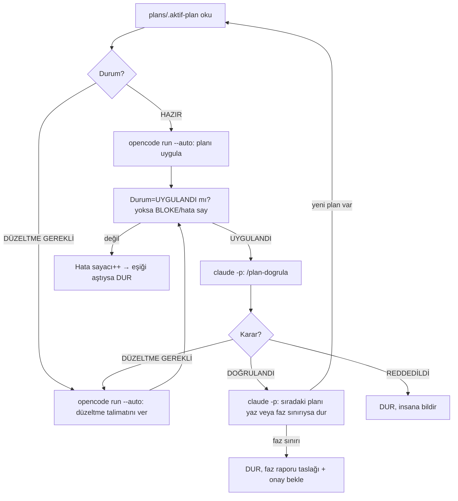

# Otonom Planla → Uygula → Doğrula Döngüsü (Tasarım)

> Durum: **HAZIR, başlatılmayı bekliyor** (proje sahibi 2026-10-01'de başlatılmasını istedi). `tools/auto-loop.sh` `--run` verilmeden hiçbir şey çalıştırmaz ve `--run` ön kontrolleri geçmeden reddedilir.
>
> **Başlatmadan önce doğrulananlar (2026-10-01):**
> - `claude -p "/plan-dogrula …"` insansız çalışıyor; `disable-model-invocation` açık `/komut` çağrısını engellemiyor (olmayan plan yoluyla denendi: dosyalara dokunmadan doğru yanıt verdi, ~0,10 $).
> - DeepSeek'in kullandığı model: `opencode-go/deepseek-v4.1-flash` (opencode oturum veritabanından okundu).
> - İnsansız `claude -p` çağrısı stdin bekliyor ("no stdin data received in 3s"); betik `</dev/null` verir.
>
> **Tasarımdan sonra kapatılan açıklar:** (1) `/plan-olustur` `plans/.aktif-plan`'ı yazmıyordu → skill'e eklendi; (2) doğrulanan plan `main`'e birleşmediğinden sıradaki plan onun kodunu göremezdi → planlar **zincirleme dal** kullanır (taban = önceki plan dalı); (3) doğrulayıcı/planlayıcı değişiklikleri commit etmiyordu → ikisi de kendi plan dalına commit eder; (4) insansız modda soru sorulamayacağı için skill'lere `AUTO_LOOP=1` kuralları eklendi (§2'deki karar yetkisi); (5) `--run` için ön kontrol: altyapı dosyaları commit'li ve çalışma ağacı temiz olmalı.

Bu doküman, `plans/README.md`'deki manuel akışın (Claude plan yazar → sen opencode'a verirsin → DeepSeek uygular → sen bana "doğrula" dersin) **insan müdahalesi olmadan** sürmesi için tasarımı anlatır.

---

## 0. Gece modu (2026-10-02, proje sahibi isteği)

`./tools/auto-loop.sh --run --branch gece/<tarih> --target F5`: proje sahibi uyurken döngü planla → uygula → doğrula adımlarını sırayla sürdürür.

| Değişiklik | Gece modunda |
|---|---|
| Birleştirme | Doğrulanan plan dalı (`bot/<ID>`) **entegrasyon dalına** (`--branch`) döngü betiği tarafından `--no-ff` birleştirilir. `main`'e dokunulmaz, push yapılmaz. Sabah sorun varsa entegrasyon dalı atılır. |
| Plan tabanı | Yeni planlar entegrasyon dalından açılır (`(taban: gece/<tarih>)`). |
| Faz sınırı | Durdurmaz: faz raporu taslağı yazılır, insan testleri STATUS "Proje sahibi testleri (bekleyen)" listesine eklenir, sonraki fazın planı yazılır. Hedef faz (`--target`) bitince `plans/.auto-loop-done` yazılır ve döngü durur. Faz `KABUL_EDILDI` yine yalnızca proje sahibinde. |
| Karar | Claude verir (ADR başlığında "otonom döngüde Claude kararı — gözden geçirilmeli"). |
| Takılma | Durum değişmezse, BLOKE olursa, düzeltme turu 4'ü aşarsa veya plan yazılmazsa döngü durmak yerine Claude'a **kurtarma adımı** yaptırır (planı düzelt/küçült, net düzeltme talimatı yaz, BLOKE sorusunu cevapla veya planı İPTAL edip sıradakine geç). Plan başına en fazla 2 kurtarma; sonra döngü durur. |
| Geçici hata | Claude/opencode hızlı başarısız olursa (rate limit vb.) 5 dk bekleyip 3 kez dener; adım zaman aşımları Claude 60 dk, opencode 120 dk. |
| Sunucular | Her adımdan önce açık sunucular kapatılır (açık exe derlemeyi kilitler). |
| Kirli çalışma ağacı | Kaybedilmez: `git stash` ile kenara alınır (mesajında plan adı ve saat). |
| Bitiş | Hedef tamam, süre (9 saat) dolması, `touch plans/.auto-loop-stop` veya kurtarmanın tükenmesi. Her bitişte Claude `docs/reports/gece-<tarih>.md` sabah raporunu yazar. |
| İzleme | `cat plans/_logs/auto-loop.state` (tek satır canlı durum), `tail -f plans/_logs/auto-loop.log`. |

## 1. Amaç ve sınırlar

Amaç: proje sahibi bilgisayar başında değilken, planlar sırayla DeepSeek tarafından uygulanıp Claude tarafından doğrulanmaya devam etsin; sorun varsa düzeltme turu otomatik başlasın; plan doğrulanınca sıradaki plan otomatik yazılıp devam etsin.

**Değişmeyen sınırlar (bu tasarımın geçersiz kılamayacağı kurallar):**

| Kural | Neden |
|---|---|
| `git push` asla yapılmaz | Uzak depo geri alınamaz şekilde değişir |
| `main`'e merge asla otomatik yapılmaz | Birleştirme kararı proje sahibine ait (`plans/README.md` akışı) |
| Faz `KABUL_EDILDI` asla otomatik işaretlenmez | `docs/17` §4: faz kapısı insan onayı gerektirir |
| `git merge/rebase/reset --hard/clean`, `rm -rf` asla çalıştırılmaz | Geri alınamaz |
| Yasak DB tabloları (`AGENTS.md` §2.7) asla okunmaz | Kişisel veri |
| Mekanik/adalet kuralları (`AGENTS.md` §2.3/§2.5) değişmez | Oyun dengesi |

Bu altısı hem `opencode.json`'daki `deny` listesinde hem Claude çağrısının `--disallowedTools` listesinde **iki kez** uygulanır; tek katmana güvenilmez.

## 2. Roller ve karar yetkisi

| Durum | Normalde | Otonom döngüde |
|---|---|---|
| Plan içeriği/tasarım kararı (yeni ADR gerektiren) | Sana tek tek sorulur | **Claude, önerilen seçenekle karar verir**, ADR'ye `(otonom döngüde Claude kararı — gözden geçirilmeli)` etiketiyle yazar, devam eder |
| Plan doğrulama sonucu (geçti/düzeltme gerekli) | Zaten objektif, karar değil | Değişmez — otomatik devam |
| Faz sınırı (bir fazın tüm planları bitti, sırada yeni faz var) | Faz sonuç raporu + senin onayın | **Varsayılan: döngü durur.** Faz raporu taslağı yazılır, `docs/STATUS.md`'ye "BLOKE: faz onayı bekliyor" yazılır. §6'da açıklanan bayrakla açarsan sınırı geçip devam eder — bunu önermiyorum, varsayılan kapalı. |
| Geri alınamaz/dışa dönük eylem | Sana sorulur | **Hiçbir zaman otomatik yapılmaz** (§1) |

## 3. Akış



Her ok tek bir **blocking** komut (önceki bitmeden sonraki başlamaz). Döngü aynı makinede, aynı anda tek plan üzerinde çalışır — paralel değildir.

## 4. Durum takibi

- `plans/.aktif-plan` — tek satır, şu an üzerinde çalışılan planın yolu (ör. `plans/F0-01-ortam-dogrulama-araclari.md`). Bunu yazan: plan bittiğinde `/plan-dogrula` (DOĞRULANDI ise) veya `/plan-olustur` (yeni plan yazınca).
- Plan dosyasının `Durum:` satırı — mevcut mekanizma (`plans/README.md` §Plan durumları), değişmedi.
- `plans/_logs/auto-loop.log` — her adımın zaman damgalı özeti (komut, süre, sonuç). Ham `opencode`/`claude` çıktıları `plans/_logs/<plan-adı>-<adım>-<zaman>.log` içinde ayrı dosyalarda (uzun olabilir, ana log'u şişirmesin diye).
- `docs/STATUS.md` — her döngüde `/plan-olustur` ve `/plan-dogrula` zaten bunu günceller (mevcut skill davranışı); ekstra kod gerekmez.

## 5. Komutlar (tam hâliyle)

**DeepSeek'e plan uygulatma / düzeltme verme:**

```bash
opencode run --auto --agent build -m "$OPENCODE_MODEL" "$PROMPT"
```

- `$OPENCODE_MODEL` — ör. `opencode/deepseek-v4.1-flash` (hesap bağlanınca kesinleşecek; hâlâ blokaj, `docs/STATUS.md`).
- `$PROMPT` — HAZIR durumunda `"plans/<...>.md planını AGENTS.md kurallarına göre uygula."`; DÜZELTME GEREKLİ durumunda plan dosyasındaki son "düzeltme talimatı" bloğunun **aynen** kendisi.
- `--auto`: `opencode.json`'daki açık `deny` kuralları hariç her şeyi onaylar. Güvenlik tamamen o `deny` listesine dayanır — bu yüzden §1'deki altı kural orada da var.

**Claude ile doğrulama / yeni plan:**

```bash
claude -p "/plan-dogrula plans/<...>.md" \
  --permission-mode bypassPermissions \
  --disallowedTools "Bash(git push*)" "Bash(git merge*)" "Bash(git rebase*)" "Bash(git reset --hard*)" "Bash(git clean*)" "Bash(rm -rf*)" \
  --output-format json \
  --model "$CLAUDE_MODEL" \
  --no-session-persistence
```

- `bypassPermissions`: terminalde kimse olmadığı için onay bekleyen hiçbir şey kalmamalı (yoksa süresiz asılı kalır). Güvenlik tamamen `--disallowedTools` listesine dayanır — aynı altı kural.
- `/plan-olustur` çağrısı da aynı bayraklarla, farklı prompt'la (`"/plan-olustur"`, argümansız — skill zaten `docs/STATUS.md`'den sıradaki işi bulur).
- `--output-format json`: driver'ın sonucu (metin yerine) ayrıştırması için.

## 6. Güvenlik ve durdurma koşulları

| Kimlik | Koşul | Davranış |
|---|---|---|
| STOP-01 | Aynı plan 3 düzeltme turunu geçti, hâlâ DOĞRULANDI değil | Döngü durur; muhtemelen plan tasarımı hatalı, insan gerekir |
| STOP-02 | `opencode run` veya `claude -p` art arda 2 kez `Durum:` satırını değiştirmeden biterse | Döngü durur (sessiz başarısızlık/kota/ağ sorunu şüphesi) |
| STOP-03 | `/plan-dogrula` kararı `REDDEDİLDİ` | Döngü durur |
| STOP-04 | Faz sınırı (§2) ve `AUTO_CROSS_PHASE` açık değilse | Döngü durur, faz raporu taslağı yazılır |
| STOP-05 | Toplam çalışma süresi `MAX_WALLCLOCK_HOURS`'u aştı (varsayılan 8 saat) | Döngü durur |
| STOP-06 | Üst üste 5 iterasyon | Döngü durur (varsayılan `MAX_ITERATIONS=5`; sen test ederken küçük tutmak için) |
| STOP-07 | `claude -p --max-budget-usd` sınırını aştı (varsayılan $10/çağrı) | O çağrı durur, driver STOP-02 sayar |

Hepsinde: `docs/STATUS.md`'nin "Blokajlar" bölümüne tek satırlık, nedeni açıklayan bir kayıt eklenir (bunu `/plan-dogrula`/`/plan-olustur` zaten yapıyor; driver kendi STOP'larında da aynı formatta ekler).

**Not:** Hem `opencode --auto` hem `claude --permission-mode bypassPermissions`, IDE'deki tüm onay adımlarını atlar. Yani döngü çalışırken dosya sistemi ve komut çalıştırma yetkisi tamamen bu iki `deny`/`disallowedTools` listesine bağlıdır. Çalıştırmadan önce ikisini de dikkatlice oku (`opencode.json` ve bu dosyadaki §5 komutu).

## 7. Ayarlar (çalıştırmadan önce `tools/auto-loop.sh` başındaki değişkenler)

| Değişken | Varsayılan | Not |
|---|---|---|
| `OPENCODE_MODEL` | `opencode-go/deepseek-v4.1-flash` | F0-01'de kullanılan model |
| `CLAUDE_MODEL` | `opus` | Sabit model; interaktif oturumun model seçiminden bağımsız |
| `MAX_CORRECTION_TURNS` | 3 | STOP-01 |
| `MAX_ITERATIONS` | 5 | STOP-06 — ilk denemede küçük tutulmalı |
| `MAX_WALLCLOCK_HOURS` | 8 | STOP-05 |
| `AUTO_CROSS_PHASE` | `false` | STOP-04; `true` yaparsan faz sınırını da geçer — **önerilmez**, kendi onayına bırakmanı öneririm |

## 8. Çalıştırma (sen onayladıktan sonra)

```bash
nohup ./tools/auto-loop.sh --run > plans/_logs/auto-loop.out 2>&1 &
```

Durdurmak için: `touch plans/.auto-loop-stop` (driver her iterasyon başında bu dosyayı kontrol eder, varsa temiz çıkar) veya süreci `kill` et.

## 9. Henüz kesinleşmemiş noktalar (senin kararın)

1. `AUTO_CROSS_PHASE` gerçekten hep kapalı mı kalsın, yoksa belirli fazlarda (ör. F0→F1 gibi düşük riskli geçişlerde) açık mı istersin?
2. `MAX_ITERATIONS` ilk denemede kaç olsun — 5 çok mu az, çok mu çok?
3. `claude -p` için gerçekten `opus` mu, yoksa daha ucuz/hızlı bir model mi (döngü uzun sürerse maliyet artar)?
4. "Claude kararıyla devam etsin" kuralını §2'deki gibi mi istiyorsun, yoksa daha geniş mi (ör. faz sınırını da kapsasın)?

Bunlara cevap vermeden döngüyü başlatmayacağım.
